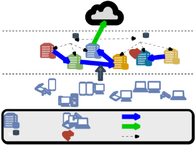
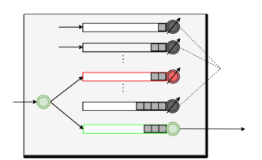
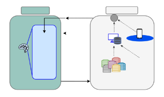
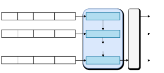
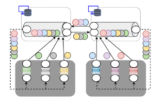
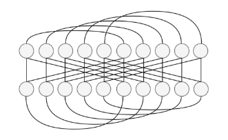
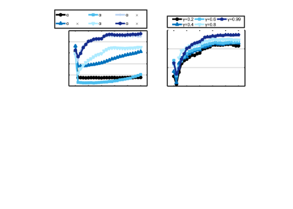
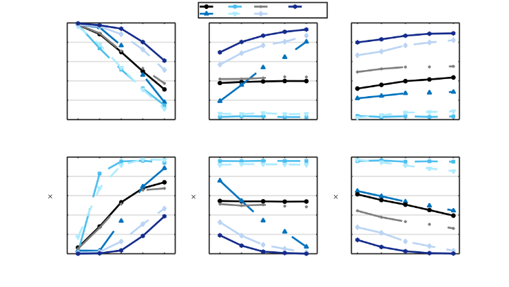
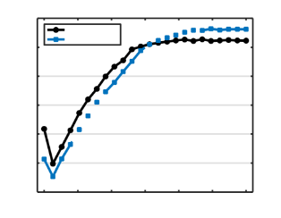

**OJ Logo**

Received XX Month, XXXX; revised XX Month, XXXX; accepted XX Month, XXXX; Date of publication XX Month, XXXX; date of current version 9 November, 2024.

**HOODIE: Hybrid Computation Offloading via Distributed Deep      Reinforcement Learning in
Delay-aware Cloud-Edge Continuum**

**ANASTASIOS GIANNOPOULOS 1 (Member, IEEE), ILIAS PARALIKAS2, SOTIRIOS SPANTIDEAS1, AND PANAGIOTIS TRAKADAS1**

1Department of Ports Management and Shipping, National and Kapodistrian University of Athens, Psachna, Evia, P.C. 34400, Greece

2Research & Development Department, Four Dot Infinity, Chalandri, Athens, P.C. 15231, Greece

CORRESPONDING AUTHOR: ANASTASIOS GIANNOPOULOS (e-mail: angianno@uoa.gr).

This work was partially supported by the ”Towards a functional continuum operating system” (ICOS) Project funded from the European

Union’s HORIZON research and innovation programme under grant agreement No 101070177.

**ABSTRACT** Cloud-Edge Computing Continuum (CEC) system, where edge and cloud nodes are seamlessly connected, is dedicated to handle substantial computational loads offloaded by end-users. These tasks can suffer from delays or be dropped entirely when deadlines are missed, particularly under fluctuating network conditions and resource limitations. The CEC is coupled with the need for hybrid task offloading, where the task placement decisions concern whether the tasks are processed locally, offloaded vertically to the cloud, or horizontally to interconnected edge servers. In this paper, we present a distributed hybrid task offloading scheme (HOODIE) designed to jointly optimize the tasks latency and drop rate, under dynamic CEC traffic. HOODIE employs a model-free deep reinforcement learning (DRL) framework, where distributed DRL agents at each edge server autonomously determine offloading decisions without global task distribution awareness. To further enhance the system pro-activity and learning stability, we incorporate techniques such as Long Short-term Memory (LSTM), Dueling deep Q-networks (DQN), and double-DQN. Extensive simulation results demonstrate that HOODIE effectively reduces task drop rates and average task processing delays, outperforming several baseline methods under changing CEC settings

and dynamic conditions.

**INDEX TERMS** Cloud computing, cloud-edge continuum, cognitive network, deep reinforcement learning, edge computing, internet of things, task offloading.

1. **INTRODUCTION**

T HEsentsCloud-Edgea distributedComputingsynergisticContinuumcomputing paradigm(CEC) repre-that integrates cloud computing resources with edge computing

resources to offer a unified, seamless computational en- vironment for the underlying end-devices [1]. Given that user equipment is battery-sensitive and resource-constrained, the CEC is designed to support a wide range of applica- tions by leveraging the combined capabilities of centralized cloud data centers and decentralized edge nodes, offering computational capacities closer to the data source and end- users [2]. By seamlessly integrating Cloud-Edge layers, the CEC enables more responsive and scalable services,

accommodating the increasing demands of modern appli- cations such as Internet of Things (IoT), smart cities, and cognitive autonomous systems [3]. The primary advantages of the CEC include reduced latency, improved bandwidth efficiency, and the ability to support real-time applications. By processing data at the edge, CEC reduces the need for data to traverse the network to central cloud servers, which in turn minimizes latency and enhances the user experience. This paradigm allows for the dynamic multi-scale allocation of resources across the continuum, optimizing both latency- sensitive and computation-intensive tasks through intelligent task distribution and resource management strategies.

This work is licensed under a Creative Commons Attribution 4.0 License. For more information, see https://creativecommons.org/licenses/by/4.0/

VOLUME , 1

**OJ Logo![ref1]**

Despite its advantages, the CEC introduces several chal- lenges, particularly in the context of task handling and load balancing. One of the key challenges is the heterogeneity of computational resources and the load dynamics across the CEC, which can lead to complex decision-making processes when determining where to offload tasks. Additionally, the dynamic and distributed nature of edge environments makes it difficult to predict resource availability and network conditions, further complicating task scheduling and load balancing [4].

Furthermore, the CEC environment demands ”beyond verticalized” task offloading (from Edge to Cloud), im- posing the need for shifting towards a hybrid (vertical and horizontal/peer-to-peer) task offloading [1]. This hybrid approach, enabled by the seamless connectivity within the CEC, allows tasks to flow not just vertically to the Cloud, but also horizontally across different Edge nodes. This flexibility introduces new dimensions to the task offloading problem, requiring the development of more sophisticated, distributed and collaborative strategies that can dynamically adapt to varying network conditions, resource availability, and application requirements. The complexity of managing both vertical and horizontal task flows necessitates a recon- sideration of traditional task offloading models, which were primarily designed for simpler, vertically-oriented systems [5]. These challenges are exacerbated by the need to meet strict latency requirements and to manage limited resources and load dynamics at both Edge and Cloud.

1. **TOWARDS HYBRID TASK OFFLOADING AND DISTRIBUTED ML**

   In the context of CEC, task offloading involves dynamically deciding whether to process tasks locally at the edge, offload them to another edge node (horizontal offloading) or to a cloud server (vertical offloading), under time-varying task arrival traffic. The primary goal of task offloading is to optimize system performance by minimizing target indica- tors, such as latency, energy consumption, and task drop ratio, to prevent bottlenecks and ensure smooth and efficient flow of CEC operations. As an optimization problem, task offloadingis constrained by several factors, including limited computational resources at the Edge, bandwidth limitations, and strict latency requirements. These constraints often lead to non-convexity of the optimization objective, where the goal is to minimize the overall task completion delay or drop rate while ensuring that tasks meet their deadlines. The non- convexity arises from the interdependent nature of offloading decisions, where the optimal choice for one task depends on the offloading decisions of other tasks, as well as the dynamic state of network resources and conditions [6].

   Traditionally, task offloading in CEC has been predomi- nantly ”verticalized,” where tasks are offloaded directly from users to nearby Mobile Edge Computing (MEC) servers, and if these servers are overloaded, the tasks are further offloaded to the Cloud for processing [7]. While this approach can

   manage task execution within certain latency bounds, it falls short in fully leveraging the potential of the CEC [5]. To overcome these limitations, there is a growing need for a more flexible approach, referred as hybrid task offloading. This approach allows tasks to be dynamically transferred not only vertically but also horizontally across edge nodes, ensuring more balanced resource utilization and reducing the likelihood of overloading any single node. Enabling hybrid task flows is particularly beneficial in practical CEC considerations, where multiple edge nodes have varying levels of computational power and network connectivity [8].

   Hybrid task offloading in the CEC can be significantly enhanced by the use of distributed Machine Learning (ML) agents. These agents can make autonomous ML-driven of- floading decisions by continuously learning from the CEC environment. As opposed to centralized ML, distributed agents require low-size state/action space representation, as they can operate autonomously at different nodes within the CEC, adapting to local conditions while contributing to global optimization. By leveraging techniques such as Deep Reinforcement Learning (DRL) [9], distributed agents can deal with the non-convexity of the task offloading problem, dynamically adjusting their strategies to minimize delays, and prevent task drops.

2. **RELATED WORK**

This subsection summarizes the outcomes of existing studies addressing the task offloading problem, categorizing them in heuristic methods, centralized learning and distributed learning algorithms.

1) Heuristic Methods

Heuristic algorithms have been widely explored in the context of task offloading, with most studies focusing in MEC, and limited studies in fog-cloud environments. These algorithms often focus on finding near-optimal solutions by simplifying the complex task offloading environment, and relaxing the constraints of the non-convex optimization. For instance, Wang et al. [10] proposed a heuristic-based algorithm for minimizing energy consumption in MEC by intelligently offloading tasks based on the current load and available resources. Similarly, Sardellitti et al. [11] developed a joint optimization algorithm for radio and computational resources, which relies on heuristic methods to balance the computational load across the edge and cloud. Other approaches have also focused on specific metrics such as latency and energy efficiency. Mao et al. [12] introduced a heuristic task offloading algorithm aimed at minimizing the total task completion time by dynamically adjusting the of- floading strategy based on real-time network conditions. You et al. [13] presented an energy-efficient resource allocation strategy for mobile-edge computation offloading that utilizes heuristic optimization to reduce the computational burden on edge devices.

**TABLE 1. Acronyms**

|Acronym|Meaning|
| - | - |
|
A&V BCO CPU CEC DM DQL DQN DRL

EA

EC FIFO FLC

HO HOODIE

ID

IoT LSTM MEC ML MLEO MSE Pub-Sub ReLU RO TRL VO
|
Advantage & Value layer

Ballanced Cyclic Offloader

Central Processing Unit

Cloud-Edge Continuum

Decision Maker

Deep Q-Learning

Deep Q-Network

Deep Reinforcement Learning

Edge Agent

Edge Controller

First In First Out

Full Local Computing

Horizontal Offloader

Hybrid Computation Offloading via Distributed Deep Reinforcement Learning in Delay-aware Cloud-Edge Continuum Identifier

Internet of Things

Long Short-Term Memory

Mobile Edge Computing

Machine Learning

Minimum Latency Estimation Offloader Mean Squared Error

Publisher-Subscriber Protocol

Rectified Linear Unit

Random Offloader

Tabular Reinforcement Learning

Vertical Offloader
|

While these heuristic algorithms provide significant in- sights and performance improvements, they often fall short in addressing the dynamic and highly variable nature of CEC environments. Given that heuristic methods often require iterative-based algorithms of polynomial (or higher) com- plexity to derive solutions, their applicability in the online network operation is questionable. The main limitations in- clude a lack of adaptability to changing network conditions, inability to operate in large-scale networks such that of CEC, and reliance on predefined rules or approximations that may not generalize well across different scenarios.

2) Centralized ML Methods

Centralized ML approaches have also been extensively re- searched to tackle the task offloading problem in MEC. These methods typically involve training a central model to predict optimal decisions based on historical data or real-time global inputs from all individual nodes. For instance, Chen et al. [14] proposed a DRL-based framework for dynamic task offloading, which trains a central DRL agent to optimize task allocation in MEC. Similarly, Li et al. [15] introduced a centralized DRL approach for task offloading to avoid

resource over-distribution based on resource reservation in MEC. Another notable work is the DRL-based offloading framework by Wang et al. [16], which focuses on meta- learning for fast policy convergence to minimize application latency in MEC. Their approach demonstrates the potential of centralized ML models to handle complex offloading sce- narios under changing environment. The AutoScale method [17], [18] proposes an RL method to optimally select the execution target for model inference to minimize energy consumption, while also penalizing for accuracy losses due to quantization at the target. It considers different types co- processors, given the characteristics of the neural model. The authors in [19] propose a DRL-based dynamic framework considering the 5G CEC, where deep neural networks are used to predict the optimal task offloadingstrategies based on real-time system metrics, optimizing the energy consumption of 5G applications. There are also works [20] studying the optimal service function chaining by considering offloading decisions in the CEC for fluid task distribution, as well as Kubernetes-based scheduling for price cost minimization and service relocation [21].

Despite their advantages, centralized ML approaches face scalability limitations, as the central model must handle a large number of edge devices and tasks, leading to potential bottlenecks. Given the centralization of data collection that is required, centralized ML may also exhibit pronounced security concerns and bandwidth overhead. Additionally, these methods often assume that the central model produce accurate decisions for each distributed node that handles, not offering any level of personalized learning on the local task traffic. Moreover, centralized models typically lack the flexibility to adapt to hybrid offloading scenarios involving both vertical and horizontal task flows, thereby limiting their effectiveness in inter-connected CEC environments.

3) Distributed ML Methods

In response to the limitations of centralized approaches, distributed ML involve deploying ML models across multiple edge nodes, allowing each node to make local decisions while also collaborating with other nodes to optimize global performance. For example, He et al. [22] developed a fed- erated learning-based approach for edge computing, where agents train local models and periodically aggregate them to create a global model. This method enables task offloading decisions that are both privacy-preserving and adaptive to local conditions. In another study, Tang et al. [23] pro- posed a distributed DRL framework where mobile devices independently learn optimal offloading strategies to locally compute tasks or vertically offload them to edge servers. Another study [24] introduces a DRL-based distributed task offloading framework aimed at balancing task execution between edge servers and cloud resources for efficient use of computational resources across the edge-cloud continuum. In another work [25], the authors propose an offloading scheme

where the agents learn to cooperate by exchanging infor- mation about their local states, aiming to better distribute the tasks and reduce the delays from bottlenecks. Similarly, other works presented a collaborative learning approach that leverages edge-cloud synergy to offload tasks from end- devices either to edge or cloud nodes in real-time [26], [27].

Despite advancements, existing distributed ML approaches also present limitations, mainly that many of these models do not fully align with the CEC principles, particularly in supporting hybrid task flows that involve both vertical and horizontal offloading. Most existing distributed ML approaches focus primarily on either IoT-to-cloud, IoT-to- edge offloading, or edge-to-cloud (vertical) collaboration. This lack of hybrid task flow support can lead to suboptimal resource utilization and increased latency in more complex CEC scenarios. Additionally, federated learning models often require frequent communication between nodes to synchro- nize their learning processes [28], which may introduce additional delays and network traffic.Lastly, the coordination overhead between distributed agents can become significant, especially in large-scale networks, potentially offsetting the benefits of distributed learning.

3. **PROPOSED SCHEME AND CONTRIBUTIONS**

In this paper, we propose a Hybrid Computation Offloading via Distributed Deep Reinforcement Learning (HOODIE), appropriate for delay-aware decision-making in CEC. Under a multi-server topology graph of CEC, HOODIE leverages distributed and autonomous DRL agents to intelligently as- sist on task placement decisions. The objective of HOODIE is to jointly optimize task computation delay and CEC throughput (or minimal drop rate) by dynamically balancing hybrid task flows across CEC resources. Unlike existing offloading schemes that rely on (i) iterative approaches with high inference delay (as in heuristic methods), (ii) huge amount of data exchange in central locations (as in centralized ML), (iii) periodical learning synchronization (as in federated learning), and (iv) vertical task flows engaging battery-sensitive end-devices (as in distributed ML in MEC), HOODIE enables dual functionality at edge nodes, allowing them to host both local and external workloads arrived from IoT layer. To reduce complexity, each HOODIE agent does not require knowledge on the decisions made by other agents. The optimization problem is formulated with known task timeouts and other task features under stochastic traffic at each agent. To solve this problem, HOODIE state input received both local task characteristics and forecasts about the upcoming load of the CEC nodes.

The contributions of the present work can be summarized as follows:

- An analytical modelling and problem formulation is presented for the mathematical description of the hybrid task offloading in CEC. HOODIE particularly fits to scenarios where both edge and cloud resources need to

  be efficiently managed to support latency-sensitive and resource-intensive applications of the end-devices.

- HOODIE algorithm is fully aligned with CEC prin- ciples to jointly minimize task latency and drop rate, supporting both vertical (edge-to-cloud) and horizontal (edge-to-edge) task flows. This is achieved by enabling dual functionality at each agent (i.e. each agent may serve either as local task processor or as host for of- floadedtasks). This hybrid model significantlyenhances resource utilization and avoids bottlenecks.
- The proposed scheme enforces autonomy in the dis- tributed decision-making, with each agent not knowing the decisions of the other agents. In this context, HOODIES facilitates the process for removing old or adding new agents in CEC.
- HOODIE agents exploit the Double and Dueling DRL techniques for learning stability [29]. To proactively adapt to time-varying workloads, the proposed algo- rithm considers as DRL inputs both local task features and forecasts about the upcoming load in the CEC.
- During the training, HOODIE considers only single- step offloading decisions in order to enforce each agent provide fast decisions and avoid ping-pong effects. Also, the delay introduced in multi-hop offloading strategies is eliminated. Under this option, HOODIE simplifies the interfacing requirements (needed in multi-scale CEC) for multi-hop offloading and, thus, can be deployed in multi-agent CEC systems.
- Extensive analyses and simulations were conducted to showcase the learning process of the HOODIE scheme and its complexity, as well as to quantify its scala- bility when the Edge layer in densified by multiple servers. Also, quantitative simulations were carried out to provide HOODIE behavior insights under dynamic task traffic settings and comparisons against baseline algorithms.

The paper is structured as follows. In Section II, all the system model elements are analytically specified. Section III formulates the optimization problem for distributed DRL- based hybrid offloading. In Section IV, we outline the proposed HOODIE scheme, along with its complexity and convergence analyses. Finally, Section V includes all the numerical outcomes for training and validating HOODIE performance, whereas Section VI contains the work sum- mary and extensions. To enhance readability, Table 1 lists all the acronyms used in this article.

2. **SYSTEM MODEL**

In this section, we thoroughly describe all the systemic, architectural and functional principles underlying the pro- posed decentralized Cloud-Edge computing system. We first present the overall system model and then we outline each of the system elements and components. Since the rest of the methodology uses multiple mathematical symbols, Table

VOLUME ,

5
**OJ Logo![ref1]**

***Cloud***

**EC 1 EC M**

***Edge***

**EA 1**

**EA N EA 2**

**Generated tasks**

**Area 1**

**Area N *IoT* Area 2**

**Horizontal Offloading Edge Agent (EA) IoT devices**

**Vertical Offloading Edge Controller (EC) Local computation Data provisioning**

**FIGURE 1. A three-layer computing system model where each Edge Agent is able to locally compute its assigned tasks or to offload the tasks either horizontally towards another Edge Agent or vertically towards the Cloud.**

2 summarizes all the mathematical notations for the ease of exposure.

1. **SYSTEM ARCHITECTURE**

As shown in Fig.1, a three-layer (IoT-to-Edge-to-Cloud) network with N Edge Agents (EAs) and one1 Cloud is

considered for covering multiple IoT areas. The network supports Edge Computing (via the multiple EAs) and Cloud computing (via the Cloud) capabilities. Let the set of EAs plus the Cloud be N = {1,2,...,N,N + 1}, where the element N +1 indexes the Cloud. For convenience, we also let E = N − {N + 1} = {1,2,...,N } denote the set including only the EA indices. Each EA n ∈ Eis responsible for computing all tasks (or applications) generated by the respective IoT area. Each task is assumed to be non-divisible, meaning that it should be computed by an EA or the Cloud as a whole (no partial computation of the same task by multiple EAs). Considering densified 6G-compliant network traffic (i.e. massive devices request the computation of numerous tasks), an efficient decision-making policy for the task computations is required.

To enable flexibility in the computation decisions, the system model allows each EA to select among three actions:

1) to compute the task locally based on its CPU processing capacity, (ii) to offload the task horizontally to another EA, or (iii) to offload the task vertically to the Cloud. Each task is also associated with a timeout index that poses the maximum waiting time of the task until computation. To ensure intelligent and decentralized decision-making, each EA runs a DRL model which receives task features and traffic information of the other EAs, with the aim to output an offloadingdecision that jointly minimize (i) the task throw ratio (respecting the timeout of the tasks) and (ii) the task

   1Here we consider a single Cloud entity without loss of generality. The system model can be easily modified to support multiple Cloud entities.

   **TABLE 2. Mathematical symbols**

 

|Symbol Meaning [Unit]|Symbol Meaning [Unit]|
| - | - |
|
N Set of EAs and Cloud E Set of EAs

M Set of ECs

T Set of time slots H Set of task sizes

N Number of EAs M Number of ECs

T Number of time slots

∆ Time slot duration [sec] P Task arrival probability

xn(t) Task arrival binary index un(t) Task ID arrived in EA n

at time slot t

ηn(t) Size of task un(t) [bits] ρn(t) Processing density of task

un(t) [CPU cycles/bit]

ϕn(t) Timeout of task

un(t) [time slot]

d(1)n (t) Binary decision for local

computing or offloading for task un(t)

d(2) (t) Binary decision for

n,k

offloading task un(t)

from EA n to node k Dn(t) Decision tuple

for task un(t)

Un(t) Number of tasks arrived

in node n at time slot t

L(t) Historical load matrix at time slot t

lpubn (t) Public queues length

hosting tasks offloaded

by EA n at time slot t G Adjacent matrix for

Edge topology
|
ψnpriv (t) Completion time slot of

private task un(t)

wnpriv (t) Waiting time of private

task un(t) [time slots] f EA,priv Private Processing

n

Capacity of EA n [cycles/sec]

R Set of link data rates RH Horizontal data rate

[bps]

RV Vertical data rate [bps] Rofn,kf Data rate between EA n

and node k [bps]

wnoff (t) Waiting time of

offloading task un(t) [time slots]

ψnoff (t) Completion time slot

of offloading task un(t) upubn,k (t) Task ID offloaded by

EA n to node k at time

slot t

ηpub(t) Size of task upub(t)

n,k n,k

[bits]

lpubn,k (t) Length of public queue

n of node k at time slot t [bits]

Ak (t) Set of active queues of

node k at time slot t Ak (t) Number of active pub-

lic queues of node k at

time slot t

fnEA,pub Public processing

capacity of EA n [cycles/sec]

f Cloud Cloud processing

capacity [cycles/sec] mpubn,k (t)

Size of the tasks thrown by public queue n of

EA k at time slot t [bits] ψn,kpub(t) of task upub(t)

Completion time slot n,k

ψ˜n,kpub(t) Computation starting

time slot of

task upub(t)

n,k

W Lookback window of

load history [time slots] Λ Set of public queue

length values [bits]

G(i,j) Binary variable indicat-

ing connection between EA i and EA j
|

VOLUME ,

**OJ Logo![ref1]**

**Edge Agent *n*** queue n′ ∈ E − {n} of each EA n ∈ E stacks the tasks **Tasks offloaded Public Queue *1*** offloaded by EA n′. For instance, if EA 5 offloads a task to **by EA *1*** EA 3, then the offloaded task is placed in public queue 5 of

**Tasks offloaded Public Queue *2*** EA 34. The Cloud includes only N public queues, with its **by EA *2*** public queue n ∈ E hosting the tasks forwarded by EA n.

**Private Queue *n*  CPU CPU** We assume also that when the computation (or offloading)

***(t) fnEA,priv fnEA,pub*** of a task is completed in a time slot, then the next task in

***un(t) d(n1)* Public Queue *N* Towards** the queue will be computed (or offloaded) at the beginning

**Public Queue *n*** of the next time slot [30].

**MakerDecision(1) *n*  Offloading Queue *n*  *dn,k(2)(t)* or Cloud**

**of Edge Agent *k***

2. **TASK CHARACTERISTICS**

**MakerDecision(2) *n***  We let un (t) ∈ Z+ denote the unique task identifier (ID) assigned to the task arrived in EA n ∈ E at t ∈ T. At a

**FIGURE 2. The internal structure of a single Edge Agent that includes** 1 given time slot t, we use the binary variable xn(t) to denote **privcomputationate queueof(foroffloadedlocal tasktasks)computation),and** 1 **offloading**N − 1**queuepublic(f queuesor task(for** if a new local task is arrived in EA n as:

**offloading).**

1, if a new task arrived in EA n at time t

x (t) =

latency (fast processing of the tasks) of the system. We also n 0, otherwise

assume M Edge Controllers (ECs) that are distributed in (1) the Edge layer. In this system model, each EC is in charge Under this definition, the task identifier (ID) can be written of monitoring a single EA (M = N, i.e. each EA has as un(t) = xn(t) ·un(t), i.e. the task ID is set to zero if no an associated controller) or a cluster of EAs (M < N ). task arrived. We also define the size of task un(t) as ηn(t) ECs are also able to transfer data from an EA to another, (in bits). The values of task size are drawn from the discrete whereas inter-controller communication is also allowed to set H = {η1,η2,...,η|H|}. The size of task un(t) can be enable data provisioning across different clusters of EAs2. also written as ηn(t) = xn(t) ·ηn(t), meaning that the size For the following, we focus on one episode that includes a of task is zero when there is no local task arrived in EA n at finite set of time slots T = {1,2,...,T }, with each time time slot t. According to the above-mentioned notations, we slot t ∈ T having a duration ∆ (in seconds). have ηn(t) ∈ H∪{0},∀n ∈ E. Furthermore, each task un(t)

From the communication perspective, we assume that IoT is associated with a processing density ρn(t) (in CPU cycles devices are served by an area-specific base station through per bit) and a timeout index ϕn (in time slots). The former wireless links (e.g. LTE, 5G), while each base station n ∈ E defines the number of CPU cycles required to process a unit is connected with the EA n ∈ E through a wired fronthaul of data, whereas the latter implies that the task un(t) should link (e.g. optical fiber)3. Also, all EAs communicate with have been computed until the time slot t+ ϕn − 1, otherwise the Cloud through e.g. the Internet (uploading/downloading it is dropped.

information).

The internal structure of a single EA is depicted in Fig.2. **C. OFFLOADING DECISION MODEL**

At the beginning of each time slot, EA n has a new task Once a new task un(t) arrives in EA n ∈ E, it requires a arrival with a certain probability P [30]. Additionally, each decision-making process regarding the computation destina- EA has dual behavior, meaning that it can either (i) act tion of the task. The offloading decision-making is achieved as local computing node for the tasks associated with the via two decision maker (DM) modules which make two corresponding IoT area or (ii) host computational tasks that successive decisions. The first-level DM(1) is placed at the are offloaded by another EA. To this end, each EA n ∈ E is entrance of EA and the second-level DM(2) is located at equipped with N FIFO computation queues to execute tasks, the exit of the offloading queue (see Fig.2). Specifically, and 1 offloading queue to stack the tasks to be offloaded. DM(1) decides whether the task is going to be computed For EA n, the computation queue n is called private queue locally or to be offloaded. Given a new task, EA n places because it is used for computing the local tasks, whereas the the new task either in the private queue (if DM(1) decides rest of N − 1 computation queues are called public queues local task computation) or in the offloading queue (if DM(1) because they are used to host external tasks. The public decides task offloading). If a task has been placed in the  offloadingqueue n, DM(2) decides the offloadingdestination

2The Edge Controller represents a logical entity that is able to collect and 

share metrics within an edge cluster using monitoring tools and interfaces. 4This association policy between the offloading EA and the destination In practice, it can be in the same or different physical location from the (public) queue avoids task collision that may occur when multiple tasks EAs that it monitors. are offloaded to the same EA at the same time. Practically, a unique

3Without loss of generality, it is also possible to assume that the base wired connection is established between the offloading EA n ∈ E and station and the respective Edge Agent are co-located. the destination queue n of computing node k ∈ N .

VOLUME ,

7
**OJ Logo![ref1]**

node k ∈ N − {n} to which the task will be computed. Formally, the output of DM(1) is:

1, un(t) is placed in private queue

d(1)n (t) = 0, un(t) is placed in offloading queue (2) where d(1)n (t) is the binary decision taken by DM(1) n ∈ E

for task un(t). Moreover, the output of DM(2) is:



1, if d(1)n (t) = 0 & un(t) is offloaded

d(2)n,k (t) = 0, if d(1)n (t) = 1 (local computation) (3)

from EA n to node k



where d(2) (t) is the binary decision taken by DM(2) n ∈ E

n,k

and denotes that, if the task is not locally computed (i.e.

(1)

dn (t) = 0), the task un(t) will be offloaded from the offloading queue of EA n ∈ E to the public queue n ∈ E of computation node k ∈ N − {n} (i.e. the task can be offloaded towards an EA or Cloud and the task cannot be offloaded to a public queue of the source EA).

Consequently, the number of bits occupied in the private queue (and offloading queue) of EA n at time slot t is equal

(1) (1)

to dn ·ηn(t) (and (1 − dn ) ·ηn(t)). Also, a task can be offloaded to at most one destination node, as reflected by the next formula:

d(2) (t) ≤ 1,∀n ∈ E (4)

n,k

k∈N{n}

Furthermore, the number of tasks arrived at the computa- tion queues (private plus public queues) of computation node n ∈ N at time slot t is given by:

d(1)n (t) + d(2)i,n (t), if n ∈ E

Un(t) = i∈E d(2)i,n(t)i∈E, {n} if n = N + 1

(5) where Un(t) is differently calculated for EAs (they have both private and public queues) and the Cloud (it has only public queues). The first branch reflects the number of tasks arrived in EA n at time slot t as the sum of the tasks that are going to be locally computed (first term) plus the tasks that are offloaded by other EAs (second term). The second branch represents the number of tasks arrived in the Cloud at time slot t as the sum of the offloaded tasks that have the Cloud as computing destination. Finally, we

define a decision tuple D (t) = d(2) ,k ∈ N − {n}

n n,k

which reflects the computing destination of task un(t). For example, if task u2(t) is offloaded to EA 3, then D2(t) =

(0,1),(1,3),(0,4),..., (0,N ),(0,N + 1) .

4. **PRIVATE QUEUE MODEL**

Each task un(t) that is going to be locally processed is placed in the FIFO private queue n of EA n ∈ E. The local tasks stored in the private queue of EA n are processed in the local

Central Processing Unit (CPU) with a processing capacity of f EA,priv CPU cycles per second (or Hz). With no loss

n

of generality, f EA,priv is is assumed constant for each EA

n

n ∈ E.

Assuming that a given task u (t) is placed in the private queue at time slot t ∈ T, we designaten ψnpriv (t) as the task

completion time slot. When no task is placed in the private queue at time t, we set ψnpriv (t) = 0. Note that completing a

task means that it is either successfully processed before the respective timeout or it is overdue and, thus, it is thrown. To derive the completion time slot of the task un(t), it is necessary to know how long the task remained in the private queue. To this end, we definewnpriv (t) as the waiting time (or the number of time slots) of task un(t) in the private queue until completion. This means that, if task un(t) is decided to be locally computed, it will stay for wpriv (t) time slots

n

in the private queue5. For a given task un(t) placed in the private queue of EA n ∈ E at time slot t, the waiting time before completion can be given by:

wpriv (t) = max 0,max{ψpriv (t′)} − t + 1 ,∀n ∈ E

n t′<t n

(6) where the outer max{·} operation ensures that negative values of wnpriv (t) are set to zero, whereas the inner max{·} operation reflects the completion time slot of the previous task with the highest completion time. Specifically, the waiting time of the task un(t) is equal to the (positive) difference between the completion time slot of the most time-consuming previous task (placed in the private queue at t′ ∈ {0,1,...,t − 1}) and the arrival time slot of task un(t). Based on the above, it is also feasible to calculate the completion time slot of task un(t) if it is placed in the private queue at time slot t, as follows:

`  `ηn(t) ·ρn(t)

ψnpriv (t) = min t + wnpriv (t) + f EA,priv ·∆ − 1,

n (7) t + ϕn(t) − 1

where the first argument of the min{·} operation is the time slot of the task completion when the task is locally processed, whereas the second argument is the time slot when the task is thrown. Also, ⌈·⌉denotes ceiling operation. Specifically, the task un(t) starts to be processed at time slot t+wpriv (t) and the processing duration is ηn(t)·ρn(t) time

n fnEA,priv·∆

slots. Otherwise, if the sum of the waiting and the processing duration exceeds the task timeout, the task will be thrown.

For instance, if a new task arrived in EA 3 at time slot 5 and it is decided to be locally computed, then u3(5) is placed in the private queue. Suppose that pre- vious tasks u3(1), u3(2), u3(3) and u3(4) have already been placed in the private queue for local computation

5Notably, the value of wpriv (t) is computed by the EA n before placing

n

the task un(t) in the private queue.

VOLUME ,

9
Giannopoulos et al.: HOODIE: Hybrid Computation Offloading via Distributed Deep Reinforcement Learning in Delay-aware Cloud-Edge Continuum![ref2]

with completion time slots ψpriv (1) = 2, ψpriv (2) = 6,

3 3

the waiting time of 3pruiv(5), we apply (6) taking wpriv (5) = 0,max{ψ (t′)} − t + 1

ψpriv (3) = 3 and ψ (4) = 10, respectively. To calculate

3

max {0,max{2,6,3,10} − 5 + 1} = 6 time slots for u3(5) wnoff (t) = max t <t noff ,∀n ∈ E (9)

3 3 ′

to wait until start of processing. woff (t) reflectsthe number of time slots required for waiting innthe offloading queue[^1]. Thus, as implied by (9), wnoff (t)

5. **OFFLOADING QUEUE MODEL** cannot be negative and is equal to the difference between the Similar to the private queues, the offloading queue of each completion time slot of the most time-consuming previous EA is a FIFO queue which is responsible for stacking the task un(t′) (∀t′ ∈ {0,1,...,t − 1}) and the arrival time local tasks to be offloaded. Once a local task u (t) of EA of task un(t). We set ψnoff (t) = 0 if there is no task for

   n ∈ E is selected for offloading, the offloading queuen of the offloading at time slot t. To compute the completion time source EA is connected to the target public queue of the slot of a task un(t) that is placed in the offloading queue of

   destination EA or the Cloud through a wired link6. Since EA n, the following formula should be used:

   it is not always possible to assume all-to-all connectivity

   across EAs in practice, we can let the symmetrical matrix ψoff (t) = min t + woff (t)+

   G denote the adjacent graph of the Edge layer topology, n n

   with each element G(i,j ) = G(j,i) = 1 when EA i d(2)n,k (t) ·ηn(t)

   can establish direct bidirectional connection with EA j, + Roff ·∆ − 1, (10) whereas G(i,j ) = 0 otherwise. When all-to-all connectivity k∈N{n} n,k

   is assumed, all elements of matrix G are equal to 17. Without t + ϕ (t) − 1 ,∀n ∈ E

   loss of generality, the link data rate for the horizontal EA-to- n

   EA communication is assumed constant for each pair of EAs (2)

   and notated as RH , whereas the link data rate of the vertical wherenode k.dItn,kisisevidentequalthatto 1(10)if andcomputesonly iftheEAcompletn offloadsion timeto EA-to-Cloud communication is RV , and it is also assumed slot as the minimum between the time slot for successfully

   constant for each EA-Cloud pair. Let also R = {RH ,RV } offloading the task and the time slot of the task timeout. denote the set of available data rates, where RH and RV are The time slot when the task is successfully offloaded to measured in bits/sec with RH > RV . If EA n ∈ Eoffloads the destination node is equal to the sum of the arrival the u (t) to the computation node k ∈ N − {n} (another

   EA orn Cloud), the data rate Roff of the communication link time slot t, the waiting time wnoff (t) and the offloading

   n,k time d(2)n,k (t)·ηn(t) . Finally, Roff = R when is calculated as follows: k∈N{n} Rofn,kf ·∆ n,k V

d(2)n,N +1(t) = 1 (task is offloaded towards the Cloud), Roff = RH , if k ∈ E − n ,∀n ∈ E (8) otherwise Rofn,kf = RH (task is offloaded towards another n,k RV , if k = N + 1 EA).

where the first (and second) branch corresponds to the data

rate of the horizontal EA-to-EA (and the vertical EA-to- **F. PUBLIC QUEUE MODEL**

Cloud) communication link. Each EA n ∈ E has N − 1 public queues to host the If we assume a task un(t) that is placed in the offloading processing of external tasks offloaded by other EAs. The queue of EA n at the beginning of time slot t, the waiting Cloud entity maintains N public queues, being capable of time in the offloadingqueue woff (t) and the task completion hosting the processing of the tasks offloaded by all EAs.

n Each public queue is matched with the offloading EA,

time slot ψoff (t) can be defined,as in the private queue case.

n meaning that the public queue i of a given node acts as Note that the completion time slot for offloading the task is

equal to the time slot number when the task is either sent to the offloading destination of EA i ∈ E. For convenience, it the destination node or dropped. For example, ψoff (5) = 16 is assumed that, if a task offloaded by EA n ∈ E arrives at

6 the destination node k ∈ N −{n} at time slot t ∈ T, then it means that the task arrived at t = 5 in EA 6 and placed in the

offloadingqueue will be completed at t = 16. The number of is placed in the FIFO public queue n for processing at time time slots required by the task un(t) to wait in the offloading slot t + 1. Upon placement of the offloaded task un(t) in queue (until completion) can be computed as follows: the public queue n of EA k at time slot t, a new task ID

upubn,k (t) ∈Z+ is assigned to the task, ensuring that the task with![ref3] source node n, destination node k and queue placement

6For the ease of exposure, here we assumed wired connections between time slot t has a unique identifier. The task ID assignment

EAs and EAs-Cloud. This assumption can be easily modified without loss rule follows the next equation:

of generality.

7Under dynamic Edge layer topologies, matrix G can be assumed as 

time-varying (i.e. G = G(t)), but here we assume constant adjacency 8The value of wnoff (t) is calculated by the EA n before making the between EAs. decision on which queue the task un(t) is placed.

11 VOLUME ,
**OJ Logo![ref1]**

public queues, which means that the processing capacity

allocated to an active task upub(t′) (t < t) at time slot t upub(t) = u0,n(t′), ifotherwiseEA n offloaded to node k (11) is fkEA,pub/Ak(t) (or f Cloud/An,kk(t)). This′ equal distribution

n,k

of the processing capacity amongst the active public queues where un(t′) stands for the task ID arrived at EA n ∈ E follows the principle of the generalized processor sharing

at time slot t′ ∈ {0,1,...,t − 1}. This means that the ID model [31]. Under this definition, the processing capacity assigned to the task at the public queue of node k is identical of the public queues dynamically depends on the number with the original task ID assigned when the task was initially of active queues at each time slot and cannot be known in arrived in the source node n. advance. Instead, each EA is only aware of the public CPU

We also defineηn,kpub(t) ∈ H∪{0} as the size (in bits) of the processing capacity of the other EAs f EA,pub and the Cloud

n

task arrived in the public queue n ∈ Eof node k ∈ N −{n} f Cloud.

at time slot t ∈ T, meaning that it is the size of task upubn,k (t). Letting mpubn,k (t) denote the size (in bits) of the tasks For completeness, if upub(t) = 0 then ηpub(t) = 0. Let also thrown by the public queue n ∈ E of node k ∈ N − {n}

lpub(t) represent the lengthn,k (in bits) ofn,kthe public queue n at the end of time slot t, the public queue length can be ofn,knode k at the end of the time slot t. For instance, if the retrospectively updated as:

third public queue of the Cloud has two tasks of 8 bits each

at the end of time slot 14, then we set lpub (14) = 16 bits.

3,N +1

A public queue n of node k is called active queue at time lpub(t) = max 0,ln,kpub(t − 1) + ηn,kpub(t)−

slot t if and only if either a new task is inserted to the public n,k EA,pub (13) queue at time slot t (i.e. ηn,kpub(t) > 0) or there are queued −mpub(t) − ∆ ·fk ,

tasks at the end of the previous time slot (i.e. lpub(t−1) > 0). n,k ρn(t) ·Ak(t)

n,k

Therefore, the set of the active public queues of node k ∈ N

at time slot t ∈ T is defined as: where the number of bits of the public queue n ∈ E of EA k ∈ E − {n} at the end of time slot t is equal to number

Ak(t) =  nnnn∈∈||ηηEEn,kn,kpubpub−(({tt))k}>> 00,ifororkll∈n,kn,kpubE((tt(for−− 1)1)EAs)>> 00,,...... (12) processedlcann,Npub +1apply(t) (13)between(i.e. bylengthreplacingt −of1 publicandfkEtA,pub(fourthqueueswithtoferm).f theCloudTCloud),o. computewe of bits stayed at the queue minus the number of bits left

pub the queue. Specifically, lpub(t) is equal to the length of the

n,k

public queue at the end of the previous time slot (first term), plus the number of bits arrived at time slot t (second term),

minus the number of bits dropped by the queue at the end ,if k = N + 1 (for Cloud) of the time slot t (third term), minus the number of bits

where the first branch is the set of the active queues for an

EA and the second branch is the set of the active queues for

the Cloud. Evidently from (12), the set Ak(t) contains the Regarding the end of the computation for the tasks stored indices of the public queues with pending tasks that have in the public queues, we define ψpub(t) ∈ T as the com-

been offloaded by the respective source EAs to the node k. n,k

pletion (task computation or timeout) time slot of the task The number of elements of set Ak(t) is Ak(t) = |Ak(t)| upub(t) (i.e. the task has been either computed or thrown by

and is equal to the number of active public queues of node n,k

node k). Given the load uncertainty over time and that the k at time slot t. ψn,kpub(t) cannot be known by neither the EA n nor the node

each EA n ∈ E is equipped with another publicnEA,prCPUiv thrown), we can indirectly define the value of ψpub(t) based Apart from the CPU for running the local tasks f , k before the task has been actually addressed (processed or

f EA,pub (in Hz) for processing the tasks stacked in the n,k pub publicn queues. Without loss of generality9, we let f EA,pub = )

1 on˜pubthe time slot of starting the computationpub (of task˜pubun,k(t)

CPU2EA,pubof f Cloud Hz, with f Cloud > f EA,pub, ∀n ∈ E. ψcann,kbe(t)e.xpressedThus, theas:relationship between ψn,k (t) and ψn,k

f = ··· = f EA,pub, whereas the Cloud has a

N

n

Assuming no priority across EAs10, the public CPU of each

EA n (or the Cloud) is equally allocated to all the active

ψ˜pub(t) = max t, max ψpub(t′) + 1 , (14) ![ref3]9It can be easily assumed that the public CPU of each EA has different n,k t′<t n,k

processing capabilities or even that each EA has multiple public CPUs with

where (14) reflects that the task upub(t) either starts being different or equal processing capacities. n,k

10Prioritized policies can be also adopted, without loss of generality. For processed immediately after its arrival to node k (i.e. at time example, it is possible to consider higher priority for the tasks of specific slot t) or waits the most-demanding of the previously stored

pub ′

EAs than others by assigning different weights per EA. In this case, the tasks (i.e. maxt′<t ψn,k (t ), ∀t′ = {0,1,...,t − 1}) to be allocation of the public queue processing capacity is achieved based on finished and starts being processed at the next time slot. In

these weights. addition, the size of task upubn,k (t) can be bounded as:

ψn,kpub (t)− 1 ∆ ·f EA,pub < η pub (t) ≤ ψn,kpub (t) ∆ ·f EA,pub **DRL Agent *s***Next state*n(t+1)* **+** Accumulation

**Environment**

ρ (t)k·Ak(i) n,k pub ρn (t)k·Ak(i) ***s**n(t)* Current state *Historical Task*

i= ψ˜ n,kpub (t) n i= ψ˜ n,k (t) (15) *rn(t+1) Load*

where the right part of the two-sided inequality (15) implies model current action ControllerEdge *Features*

DRL Reward for

IoT Area *n* that the size of the task upub (t) does not exceed the number *Load Level*

n,k

of bits processed by node k within the computation time EA *n*

interval of the same task, whereas the left part implicitly

forces the number of bits processed within ψ˜ pub (t) and Other EAs Cloud ψpub (t)− 1 to be lower than the size of task upub (tn,k). Overall, ***a**n(t) k        - {n}*

Current action

inequalityn,k (15) tells that there are still bits ofn,ktask upubn,k (t) to

VOLUME , 13
**OJ Logo![ref1]**

be processed within ψpub(t)− 1 and ψpub(t). Note that (15)

n,k n,k

stands for EA-to-EA offloading (i.e. n ∈ Eand k ∈ E−{n}) and, at a given slot i ∈ T, it should be n ∈ Ak(i). In the case of EA-to-Cloud offloading, inequality (15) can be used

by replacing fkEA,pub with f Cloud.

**G. HISTORICAL LOAD LEVELS**

ECs keep track of the historical load timeseries of each EA and the Cloud. The load of a node k ∈ N at time slot t is expressed as the number of active queues Ak(t). To this end, ECs maintain a matrix of the load levels per node, denoted as L(t)11. This matrix has dimensions W × (N +1), where W is the lookback window and N +1 is the number of the computing nodes (i.e. all EAs plus the Cloud). As such, L(t) contains in each column j ∈ N the load of node j from the time slot t − W to time slot t − 1. Each element (i,j ) of matrix L(t) reflects the number of active queues of node j at time slot t − W + i − 1, as expressed in the following:

Li,j (t) = Aj (t − W + i − 1),

(16) ∀i ∈ {1,2,...,W },∀j ∈ N,

where max{Li,j (t)} = N − 1, for i ∈ {1,2,...,W } and j ∈ E (max number of active queues in the EAs), whereas max{Li,j (t)} = N, for i ∈ {1,2,...,W } and j = N + 1 (max number of active queues in the Cloud). Based on the above, the matrix L(t) has the following structure:

  A1A(t1(−t −.WW+)1) ......... AN +1 ...  (17)

AN +1(t − W)

(t − W + 1)

L(t) =  ..

A1(t − 1) ... AN +1(t − 1)

Given that there are M distributed ECs in the Edge Layer of the CEC system, each EA is capable of receiving a single or multiple columns of matrix L(t) upon request to the associated EC (e.g. the nearest EC or the EC that controls

11We assume that the number of active queues is shared by each EA and the Cloud at the end of each time slot. The bandwidth overhead for sharing the load levels is negligible, since, in the worst-case, the Cloud broadcasts ⌈log2 N ⌉bits to the ECs, whereas each EA transmits ⌈log2 (N − 1)⌉bits to the associated EC.

**FIGURE 3. The DRL interaction loop between a given EA** n **and its environment for optimal handling the task offloading in the CEC. The environment of EA** n **involves its IoT area tasks and all the CEC computing nodes, including the other EAs and the Cloud.**

the respective cluster of EAs). Specifically, at each time slot t, each EA requires the W previous load values of the other nodes for purposes of inferring the local HOODIE DRL model, as shown in Section A.

Overall, the time spent on profiling computation and communication performance can be assumed minimal due to two reasons: (i) Profiling is performed instantly and in parallel during other tasks’ execution and communication, meaning that the system collects and computes data without introducing significant delays; (ii) Profiling data are com- puted and stored at the end of each time slot, allowing the RL agent to use the data in the next decision-making phase without interrupting the current operations.

3. **DECENTRALIZED VERTICAL AND HORIZONTAL TASK OFFLOADING IN CEC**

   In this section, the main principles and the mathematical modelling underlying the HOODIE algorithm are outlined. Considering a multi-agent DRL scheme, where each EA acts as a DRL agent, a decentralized hybrid (i.e. vertical and horizontal) task offloading across CEC is proposed. In brief, at a given time slot, each EA observes the CEC environment state (local task characteristics, load forecasting of the other nodes) and makes a decision (local computation, vertical offloading or horizontal offloading). The way that EA-specific HOODIE models are trained aims to ensure that long-term offloading decisions jointly minimizes a two-fold cost function: (i) the task execution latency, and (iii) the task loss rate due to timeout disrespect.

1. **DRL MODELLING ELEMENTS**

It is assumed that each EA n ∈ E runs a DRL model for purposes of making efficient decisions on task computation or offloading. In general, multi-agent decentralized DRL schemes are characterized by: (i) the state that is observable by each DRL agent at each time slot, (ii) the available actions that each DRL agent is able to take, and (iii) the reward or punishment received by each DRL agent as a result of taking

VOLUME , 
**OJ Logo![ref1]**

**TABLE 3. DRL terminology**

1) State space

   We let S = {S1,S2,..., SN } denote the set of EA-specific sets, which means that the element n ∈ E of set S is the finite and discrete state space of EA n, which is defined as Sn = {sn(1),sn(2),..., sn(T)}. Specifically, at the start of time slot t ∈ T, each EA model n ∈ E observes the state vector sn(t) which is given by:

|Symbol Meaning [Unit]|Symbol Meaning [Unit]|
| - | - |
|
S Set of state spaces

of all DRL agents

sn(t) State vector of DRL

agent n at time slot t rn(t) Reward received by DRL

agent n at time slot t

C Penalty for task loss

ϵ

Value of ϵ-greedy policy

πn

Policy of EA n for task offloading Discount factor

γ

Qn(·)

Q-value of a state-action pair of EA n

Qˆ n(·)

Qˆ -value of a state-action

pair of EA n Advantage-action value of action a under sn(t) Learning rate

An(·)

αlr

NR

Size of replay memory Target Q-model parame- ters of DRL agent n

θˆn
|
Sn State space of

DRL agent n

an(t) Action vector of DRL

agent n at time slot t Φn(t) Cost for processing

task un(t)

Φprn iv (t) Cost for processing

task un(t) locally

Φpubn (t) Cost for processing

task un(t) externally πn∗ Optimal policy of EA n

for task offloading

θn Q-model parameters

of DRL agent n

Vn(·) State-value of a

given state sn(t)

Ncopy Update frequency of

Qˆ -model

MSE(·)

Loss function of HOODIE model

NE Number of training episodes

NB Batch size

Dn(t) Set of previous tasks of

EA n completed exactly at time slot t
|

sn(t) = ηn(t),wnpriv (t),wnoff (t),

(18) lpub(t − 1), L(t)

n

lpub n,k

where, for each EA n ∈ E, the vector lpubn (t− 1) = (t−

1),k ∈ N −{n} . For instance, we can compute the length of the public queues hosting the tasks offloaded by EA 2 at time slot t − 1 as lpub(t − 1) = lpub(t − 1),lpub(t −

2 5,1 5,3

1),lpub(t − 1),...,lpub (t − 1) . Thus, the state vector of

5,4 5,N +1

an EA n is comprised of some local observations at time the local computation12 ofn lpubn (tnpr−iv 1) at timenof slotf t − 1

slot t (i.e. the values of η (t),w (t) and w (t)), and according to (13). Notably, each EA knows the number of

bits that it has offloaded to another node at each time slot. Since each EA broadcasts the number of active queues at each time slot, it can also compute the number of bits related to its offloaded tasks and processed by another node. This is achieved by checking (i) whether there are remaining bits of a given task to be processed at the current time slot, and

2) whether the timeout of the task has passed. For instance, if EA 5 has offloaded a task of size 100 bits to EA 2, it can compute the number of its bits processed at the end of

a given action from a particular state. As in Markov Decision

time slot t by locally computing the term ∆·f EA,pub . To this 2

Processes, a DRL agent transits from an environment state

ρ5(t)·A2(t)

to another according to its actions, while also receives a

end, EA 5 needs to know only (i) the processing capacity f2EA,pub of EA 2 (it is known from the beginning of the

reward in each of the state transitions. Since each DRL

agent has local observability of its own state in multi-agent

training process as global variable) and (ii) the number of active queues A2(t) of EA 2 at time slot t (it is shared by each EA through EC).

DRL schemes, rewards are the only way for a DRL agent

to sense whether a local (and, usually, optimistic) decision

is beneficial for the global system. Hence, the main goal is

Noteworthy, the state vector of each DRL agent at time slot t involves, among others, a forecasting value of the load level of each computing node at the next time slot t + 1. This is achieved by passing the W previous values of the load timeseries through an LSTM network, as illustrated in Fig. 5.

to find, for each DRL agent, the (sub)optimal mapping from

local states to local actions, so as to ensure system-wide cost

minimization.

For the ease of exposure, Table 3 tabulates all the

acronyms related the DRL terminology and symbols. Note

that, as shown in the general DRL interaction loop of Fig. 3,

Regarding the state space dimensionality of vector sn(t), the number of all possible states that can be visited by a single DRL agent is equal to H × T 2 × ΛN × {0,1,...,N }W ·(N +1), where Λ is the set of public queue length values.

each DRL agent treats the local task features and the rest of

the DRL agents (and the Cloud) as part of its observable

external environment, meaning that the local states and

actions concerning the EAs are independent between each

other, whereas all actions affect the common CEC system.

In other words, the load of EA 5 is part of the environment 

of EA 2, and vice versa. The HOODIE model used by each 12To compute lpubn,k (t − 1) based on (13), each EA n knows how many EA n is depicted in Fig. 4. Below, we present the local state, bits have been removed (processed or thrown) from the public queue n of

the local action and the system-level cost function for each all the other nodes k (other EAs and Cloud). Thus, the terms mpubn,k (t) and DRL agent. ρ∆n·(ftkE)·A,pubAk (t) of (13) are known by each EA n.

VOLUME , 15
Giannopoulos et al.: HOODIE: Hybrid Computation Offloading via Distributed Deep Reinforcement Learning in Delay-aware Cloud-Edge Continuum![ref2]

2) Action space

Once a new task un(t) is arrived in EA n at the beginning of the time slot t, the DRL agent observes the state vector sn(t) and takes an action an(t) for this task. The action is two-fold and concerns both the DM(1) (whether the task is going to be locally processed or not) and the DM(2) (to which node the task will be offloaded), as defined in Section

C. This dual decision is reflected by the action vector an(t), which is selected by EA n ∈ E at time slot slot t ∈ T, as follows:

an(t) = d(1)(t),Dn(t) (19)

n

It is worth mentioning that every new action an(t) that is taken at time slot t changes the environment state, thus sn(t+1) = sn(t). This is attributed to the fact that each task offloading decision changes the environment state in terms of the length of the private and public queues, the waiting time for processing or offloading and the upcoming load. Also, the number of available actions for a given DRL agent is equal to {0,1}N +1, denoting that each element of vector a (t) can be either 1 or zero13.

n

3) Cost function

By taking an action an(t) from a given state sn(t) at time slot t, the DRL agent n ∈ E causes a new environment state sn(t + 1), while also receiving a reward rn(t + 1). The reward rn(t +1) received at time slot t +1 refers to the action an(t) taken at time slot t, and can be either positive or negative. Also, the aim of using rewards, which are returned by the environment to the DRL agent, is to represent the cost function of the problem.

Here we consider the joint minimization of the task execution delay (i.e. the time interval between task arrival and task execution) and the task loss ratio (due to timeout violation). To this end, the reward rn(t + 1) is given by:



NaN, if x (t) = 0 (no task arrived) −Φn(t), if ψnpriv (t) < t + ϕn − 1

rn(t + 1) = or ψnn,kpub(t′) < t + ϕn − 1

 (task successfully processed) −C, otherwise (task thrown)

(20) where Φn(t) is the cost (combining delay for local or offloaded processing) of task un(t) (from task arrival to task execution) and C > 0 is a constant penalty received if the task is thrown. The three cases of the rewarding

13The action vector is comprised of N +1 elements, with each element taking values from {0, 1}. In most cases, one element is set to 1 and the rest are set to 0, but there are also chances to have multiple 1’s. This is the case when we have equally good actions (e.g. it is equally good to offload a task to either EA 3 or EA 5). In this case, we select randomly one of those options.

function includes: (i) the reward is omitted (denoted as ’Not- a-Number’ (NaN)) if no task arrived, (ii) a negative value of −Φn(t) if the task was successfully processed, or (iii) a negative penalty −C if the task was thrown. Note that

ψn,kpub(t′) is the time slot when the task un(t) was processed upon offloading (un(t) arrived in EA n at time slot t and

was placed in the public queue of node k at time slot t′ > t). The cost received upon processing the task un(t) reflects the delay term, and is defined as follows:

Φpriv (t), if d(1) = 1 (local processing)
Φn(t) = n n (21)

Φpubn (t), if d(1)n = 0 (offloading)

where Φprn iv (t) is the cost for processing the task un(t) locally and is given by:

Φpriv (t) = ψpriv (t) − t + 1 (22)

n n

and Φpub(t) is the cost for processing the task in another

n

node and is computed as:

T

Φpubn (t) = d(2)n,k (t) ψn,kpub(t′) − t + 1 (23)

k∈N{n} t′=t

Note that, the term +1 in (22) and (23) implies that the processing of task arrived at t starts at the next time slot.

2. **PROBLEM FORMULATION**

This section presents the optimization problem for optimally handling the offloading decisions in CEC systems. The goal is to enable each distributed DRL agent (located in each EA) making optimal offloading decisions so as to ensure low task delay and low task loss rate. Let πn denote the policy learned by DRL agent n ∈ E, which is the mapping

from the state space to the action space, i.e. s (t) −π→n a (t), n n

∀sn(t) ∈ Sn. The main objective of each DRL agent n is to findthe optimal policy π∗ that maximizes the expected long-

n

term negative reward (which is cumulatively collected during a series of time slots). This is expressed in the following objective function:

π∗ = argmax E γt−1 ·rn(t) πn

n πn

t∈T (24) subject to: constraints (4),(6)-(7),(9)-(11),

(13)-(15), (20)-(23)

where function E{·} is the expectation over the random and time-varying task arrivals, task characteristics, and the deci- sions made by the other DRL agents. Also, γ ∈(0,1] is the discount factor which scales the future rewards. Evidently, (24) implies that the HOODIE problem is efficiently solved by finding the optimal series of actions which return the maximum accumulative costs. Note that, the ideal policy would converge in zero rewards, since we have defined negative rewards (because delays reflect negative impact on the task completion).

17

VOLUME ,
**OJ Logo![ref1]**

*ηn(t) ηn(t)*

*wnpriv(t) w priv(t)*

*n*

*wnoff(t) wnoff(t)*

*ln,1pub(t-1)* A

*N ln,2pub(t-1) Q(**s**n(t),**a**n(t))* **l***npub(t-1) ln,N+1pub(t-1)* **a***n(t)*

***L** (t) N+1 L1(t+1)*

***L**12(t) N+1 L2(t+1)* V

***L**W(t) N+1 LN+1(t+1)*

**FIGURE 4. The HOODIE neural network structure for DRL agent (or EA)** n**, which estimates the** Q**-value of being in state** sn(t) **and taking any of the available actions** a (t)**. Symbols** L (t) **denotes the** i**th row of matrix** L(t)**.**

n i

4. **HOODIE SOLUTION**

To solve the optimization problem defined in (24), this paper proposes the HOODIE algorithm. This algorithm is based on the principle of DRL and, especially the Deep Q-Learning (DQL) [7], [32]. HOODIE enables each EA to use a DQL-based model for making decisions on task offloading in a decentralized manner. As DQL is a model- free approach, HOODIE can be applied for efficient task offloading in the CEC, without requiring analytical and complicated information of the large-scale system state (e.g. there is no need for an agent to know the others’ decisions). According to the DQL, each DRL agent n ∈ E holds a deep neural network (the so-called deep Q-network) which estimates the ’quality’ (or the Q-value) of each state-action

pair. In other words, each DRL agent estimates the Q- function Q sn(t),an(t) . In specific, the Q(·) function

reflectsthe expected long-term reward of being in state sn(t) and taking action an(t). Thus, by properly training the deep Q-network, each EA can continuously select the actions with the minimum cost.

1. **THE HOODIE MODEL**

The structure of the HOODIE neural network model is depicted in Fig. 4. Note that the training of the HOODIE model of DRL agent n is to properly adjust all the network parameters θn (i.e. the matrix containing the weights of all connections and the biases of all neurons), such that the Q-values of all possible state-action pairs are accurately predicted. Below, the HOODIE layers are outlined.

1) Input layer

The input layer consists of the state vector, including the task size, the waiting periods in the private and the offloading queues, the length of the public queues of the other nodes, and the predicted load levels of all nodes. This means that, to produce beneficial task offloading decisions, the HOODIE model of a DRL agent takes into account predictions about the load level of the other nodes. Intuitively, being aware of the future load of the other nodes can guide the model

***L**1(t)* LSTM1

*L1,1(t) L1,2(t)* ... *L (t)* LSTM Unit *L1(t+1) L2,1(t) L2,2(t) **L**2(t)*... *L1,N+12,N+1(t)* LSTM Unit *L2(t+1)*

***L**W(t)*

*LW,1(t) LW,2(t)* ... *LW,N+1(t)* LSTM Unit *LN+1(t+1)*

**FIGURE 5. LSTM model for predicting the upcoming load of each node at time slot** t + 1 **based on** W **previous values (relative to the current time slot** t**) of each node-specific load.**

to select delay-aware decisions (i.e. offloading towards over- loaded nodes will be avoided). Thus, the HOODIE model receives a W-element history (provided by matrix L(t)) for each node and passes it through an LSTM model to obtain the predicted load in each node at the next time slot.

2) Fully-connected hidden layers

The Q(·) function is estimated via the usage of multiple fully-connected layers which are stacked consecutively. The internal structure of the each fully-connected layer contains a pre-defined number of hidden neurons, each one having a Rectified Linear Unit (ReLU) as activation function. Each neuron of a given layer is connected to all neurons of the next layer.

3) Dueling DQL layer

The output of the fully-connected layers is inserted to an Advantage & Value (A&V) layer, which implements the technique of dueling DQL [29]. Dueling DQL has been widely used as an efficient DRL technique with improved learning ability in mapping state-action pairs to Q-values.

The idea underlying dueling DQL method is to decompose the learning of the Q(·) function in two different compo-

nents: (i) the state-value function Vn sn(t) θn (quantifies

the contribution of the state in the Q-value), and (ii) the action-advantage function An sn(t),a θn (quantifies the

contribution of the action in the Q-value, given a state). In this sense, dueling DQL can better approximate the Q- values, since the long-term rewards are assessed separately for states and actions [29]. Both functions A(·) and V(·) are estimated by two fully-connected layer-based subnetworks, mentioned in Fig. 4) as A and V, respectively.

4) Output layer

By passing a state-action pair through the HOODIE model of EA n with parameter θn, the output layer provides the Q-value of being at being at state sn(t) and taking action a ∈ {0,1}N +1, which is given by:

VOLUME ,

19
**OJ Logo![ref1]**
|Algorithm 1 HOODIE training in EA n ∈ E|
| - |
|
1: Learning inputs: T, αlr , γ, NE , NR , NB , N

copy

2: Initialize Replay Memory with NR rows

3: Initialize Qn-model with random θn

4: Initialize target Qˆ n-model with random θˆn

5: Initialize CurrentEpisode = 0 and ϵ = 1

6: for each episode i = 1,2,...,NE do

7: Initialize sn(1)

8: for each time slot t = 1,2,...,T do

9: Set xn(t) = 0 {Assume no task arrived}

10: Pick a random number rand ∈[0,1]

11: if rand < P then

12: Set xn(t) = 1 {New task arrived}

13: end if

14: if xn(t) = 1 then

15: Set a new task ID un(t)

16: Select action an(t) for un(t) based on (26) 17: end if

18: Observe next state sn(t + 1)

19: for each completed task un(t′) ∈ Dn(t) (27) do 20: Collect reward rn(t′) of task un(t′) based on (20

sn(t′), an(t′),rn(t′), sn(t′ +

21: Store experience

1) end for

22:

23: Sample a random batch B of NB experiences 24: for each experience row i ∈B do

′ Assume row format as sn,i,an,i,rn,i,sn,i

25:

if t = T {Terminal time slot} then

26:

Set target yn,i = rn,i

27:

28: else

29: {Double Q-learning}

30: Set target yn,i =

rn,i + γ·Qˆ s′n,i,argmax Q sn,i,a n | θˆ

′ ′ | θ

a′

31: end if

32: Set predicted zn,i = Qn sn,i,an,i|θn

end for

33: 34: 35: 36:

Set target values YnTarget(t) = {y },∀i ∈B

Set predicted values YnPred(t) = {n,izn,i}, ∀i ∈B Update parameters θn to minimize loss function:

MSE YTarget(t),YPred(t) (see (28))

n n

37: end for

38: Set CurrentEpisode = CurrentEpisode + 1

39: if mod(CurrentEpisode,Ncopy ) = 0 then

40: Set θˆn = θn

41: end if

42: if CurrentEpisode ≤ NE /2 then

43: Set ϵ = 1 − 2(CurrentEpisode − 1)/NE

44: else

45: Set ϵ = 0

46: end if

47: end for

48: Output: Optimal policy πn∗ for action-value function Q
|

Q s (t),a θn = Vn sn(t) θn + An sn(t),a θn

n n

1 ′

− 2N +1 A sn(t),a θn

a′∈{0,1}

n

N +1

(25)

where {0,1}N +1 represents the action space of each DRL agent, with size 2N +1 (all possible actions). As imposed by (25), the Q-value is computed as the sum of the state-value and the action-advantage value, with the latter being rela- tive to the mean action-advantage value across all possible actions.

2. **THE HOODIE ALGORITHM**

This section describes the training and the inference phase of the proposed algorithm. The HOODIE algorithm incor- porates N distributed models (one model per EA), each one acting as a task offloading suggester. We consider each EA hosting both the training and the inference of the local HOODIE model.

\1) Training phase

Algorithm 1 presents the pseudocode for training a single- agent model based on the experience replay technique [32]. Specifically, each transition from a given state to another is recorded in the so-called experience tuple

sn(t),an(t),rn(t + 1),sn(t + 1) and is stored in the experience replay memory, which has a size of NR rows. In each of the NE training episodes, the DRL agent runs for T time slots. To estimate the Q-values, each DRL agent n holds two deep neural networks: (i) the Qn-model with parameters θ which is used for selecting actions, and (ii) Target Qˆ n-modeln with parameters θˆn which is used for

estimating the expected long-term rewards. The idea behind using the Target Qˆ n-modelis to provide target or groundtruth

values for calculating the error of the Q-values predicted by the Qn-model. Both neural networks have exactly the

same architecture, whereas the parameters θˆn are uploaded more rarely than θ . Thus, every N training episodes,

θn parameters are copiedn to the θˆn parameters.copy

The input of the Algorithm 1 is the set of T,αlr ,γ,NE ,NR ,NB ,Ncopy learning hyperparameters (that influence the training convergence), whereas the output is the learned policy π∗ defined in (24). This way each agent

n

n ∈ E can take placement decisions on tasks arriving from its IoT area according to the locally learned Q-function. The algorithmic steps can unfold as follows. In each training episode, the HOODIE agent initializes (Line 7) the state

as sn(1) = [ηn(1),wnpriv (1),wn (1),lpubn (0),L(1)], where ln,kpub(0) = 0 and L(1) is a zero matrix. Then, the agent

off

enters in T iterations (Lines 8 − 37) for the episode time slots. In each time slot t, a new task un(t) is arrived from IoT are n with probability P (Lines 9 − 13). In case

VOLUME ,

23
**OJ Logo![ref1]**

of a new task arrival, the HOODIE agent selects either an exploratory or exploitative action an(t) following the ϵ-greedy policy as (Line 16):

Random value of (19), if rand < ϵ

a (t) = (26)

n argmina Qn sn(t),a|θn , if rand ≥ ϵ

where rand is a random number in [0,1] and ϵ is a value updated in each episode according to the Lines 42 − 46. Based on the above, with probability ϵ, the agent chooses a random action (i.e. exploration), whereas with probability 1 − ϵ, choose the lowest Q-value action by inferring the Qn-model (i.e. exploitation). The ϵ starts at 1 and decreases linearly to 0 during the first N/2 episodes, whereas it is set at 0 for the remaining N/2 episodes (i.e. only exploitation). Since other agents operate under the same CEC environment, each HOODIE agent n observes the new state (Line 18), regardless of whether a new local task was arrived or not.

Since the processing and/or the offloading of task may take many time slots to be completed, the reward of previous tasks arrived at t′ < t may be collected at the current time slot t. To this end, the HOODIE agent n collects (at time slot t) the set Dn(t) of previous tasks that completed exactly at time slot t, which is given by:

Dn(t) = un(t′) t′ < t and ηn(t′) > 0 and

(27) ψnpriv = t or ψn,kpub = t

where Dn(t) contains the ID of tasks that are completed exactly at time slot t. This implies that Dn(t) aggregates the tasks with positive size (ηn(t′) > 0) arrived in EA n in a past time slot (t′ < t) and had completion time slot equal to t, either after local (ψpriv = t) or external computation

n

at node k (ψn,kpub = t). Thus, in Lines 19 − 22, the agent n collects the rewards for all previous tasks in set Dn(t) and stores their corresponding experience tuples into the replay memory. In Lines 23 − 33, the agent prepares a batch B of samples to which the Qn-model will be updated on. To do so, it samples randomly NB rows from the replay memory (Line 23), and, for each sample i ∈ B, calculates (i) the target values {yn,i} (Lines 26− 31) according to the Double DQL formula [33] and (ii) the predicted values {zn,i} (Line 32) by inferring the Qn-model. In Lines 34− 36, parameters θn are adjusted so as to minimize the loss function:

2) Inference phase

The inference phase of HOODIE scheme is performed by deploying distributed HOODIE models (only the Q-models) at each one of the N EA sites. Upon receiving a new task, each HOODIE model is inferred by a state vector for pur- poses of properly selecting the best computing destination. In this sense, the inference algorithm is a short version of Algorithm 1 by (i) avoiding Lines 23− 36 in each time slot, (ii) neglecting Lines 38− 46 in each episode and (iii) setting constantly ϵ = 0 to select only exploitative actions in Line 16.

3. **COMPLEXITY CONSIDERATIONS**

Time complexity can quantified from Algorithm 1 as the overall and worst-case number of iterations performed by each agent, as a function of the learning hyper-parameters using the big-O notation. Since the training contains NE episodes and T time slots per episode, the training com- plexity has at least NE · T iterations. Also, in the worst- case, there are (i) Nprev (with Nprev denoting the length of Dn(t)) iterations per time slot (in Lines 19 − 22) that loop over the previous tasks completed at time t, as well as (ii) NB iterations (Lines 24− 33) that loop over batch samples. The most time-consuming loop between (i) and (ii) is (ii), since it contains updates of the target values upon inference

of Q- and Qˆ -models; thus the training complexity has at least NE ·T ·N iterations14. In Line 36, it is implied that at

B

each time slot, the parameters θn of the Q-model are updated through feed-forward and back-propagation steps, according to the Gradient Descent (GD) method. Let NFF and NBP denote the number of arithmetic operations (multiplications, weighted summations, differentiation) required for the feed- forward and back-propagation steps, respectively, of a single experience tuple[^2]. Integrating the above, the computational complexity for training the HOODIE scheme is O NE ·T ·

NB ·(NFF + NBP ) .

Note that, since the training of the multi-agent HOODIE scheme is performed once (or rarely in time for soft retrain- ing), the above-defined complexity corresponds exclusively to the HOODIE training. When HOODIE is used for infer- ence purposes, the associated complexity reflects only the feed-forward passes of the new inference samples (i.e. only

multiplications and weighted summations to produce the Q- values of the input vector). As such, the inference complexity for a single inference sample is O NFF .

MSE Yn (t),YPred(t) = N NB z − yn,i 2

Target 1

n n,i

B i=1

(28) where MSE(·) reflects the mean (across batch samples) squared error between the vector of predicted YPred(t) and

n

target YTarget(t) values. Finally, Lines 39 − 41 ensure that

n

the parameters θn are copied to θˆn every Ncopy episodes.

14More strictly, we could write NE · T · (NB + Nprev ) iterations; however the term Nprev is neglected for simplicity of presentation, since it reflects the count of simple arithmetic operations and, hence, O(Nprev ) << O(NB ).

15The time cost for performing feed-forward and back-propagation steps

is positively correlated to the input size of the experience tuples, the size of the output (i.e. output neurons) and the DQN density (i.e. number of hidden layers and neurons).

VOLUME ,

**OJ Logo![ref1]**

we propose the publish-subscribe (Pub-Sub) protocol [37], **EC *1* EC *2*** as shown in Fig. 6. According to this protocol, each cluster

*Message Broker Message Broker* of EAs is managed by an EC, which acts as a broker for Topic 'C-1' Sub **6 5 4** Pub Topic 'C-2' message exchanges [38]. EAs subscribe to a dedicated topic

Pub Pub

**6 5 4 3 2 1** Pub **3 2 1** Sub **6 5 4 3 2 1** (e.g., ‘C-1’ for EC 1, ‘C-2’ for EC 2, and so on) and publish updates (in the form of messages) on load history and public

*Messages* queue length at the end of each time slot. Similarly, ECs

**1 2 3 4 5 6** are also subscribers to their own topic to receive updates

Pub Pub Pub Pub Pub Pub from EAs in their cluster, whereas, to achieve also inter- **~~EA *1* EA *2* EA *3* EA~~ *4* ~~EA *5* EA *6*~~** ECs communication, ECs can communicate with one another

Sub Sub Sub Sub Sub Sub by subscribing to each other’s topics for cross-cluster data sharing. ECs disseminate the aggregated messages to all

**Cluster *1* Cluster *2*** subscribing agents within the cluster, enabling all other EAs in the cluster to receive this shared information in the next

**FIGURE 6. The Pub-Sub communication protocol for data sharing within** time slot. This decentralized approach enables efficient and **and across clusters of EAs via the usage of ECs as message brokers.**

scalable communication across agents.

However, communication delays due to network conges-

4. **CONVERGENCE CONSIDERATIONS** tion or latency can prevent some EAs from receiving up-to- The convergence assurance of reinforcement learning algo- date information in time for the next decision-making phase. rithms can be only proven in the simple tabular RL (TRL), To address the potential impact of communication delays, where the Q-function is computed by using a table of state- HOODIE can integrate a recovery mechanism that leverages action pairs [34]. This Q-table has a number of rows equal to the temporal learning capabilities of LSTM models. When an the number of all possible states (that the agent receives as EA fails to receive updated information from its peers due to input) and a number of columns equal to the number of all a delay, the system occasionally exploits the previous time- available actions. In this case, for each state-action pair, the slot’s output of the LSTM model as an input for the current Q-function is calculated using the Bellman’s equation [34]. decision-making process. Similarly, if the metric lpubn (t − 1) As a result, TRL can be efficiently used only in simple is delayed at time slot t, the agents can occasionally use small-scale problems (in which the agent considers a small lpubn (t − 2) to avoid network blocking. This allows the state-action space) and cannot be considered in practical and delayed EA to continue making informed decisions based on large-scale problems (due to time and memory inefficiency historical data, without waiting for the delayed information for storing the Q-table). to arrive. Once the missing message is eventually reached, In the case of HOODIE algorithm, we use approximation ECs can integrate it in the load history for providing valid of the Q-function through the use of deep neural networks samples in the future slots.

   (Q-model and target Qˆ -model), given that the state-action The combined use of Pub-Sub protocol with the proposed space size is H×T 2 × ΛN ×{0,1,...,N }W ·(N +1) (all avail- recovery mechanism ensures that the system remains re- able states) and {0,1}N +1 (all available actions), respec- silient to delays, given that it provides (i) non-blocking oper- tively (see Table 2 for the symbols meaning). The formalistic ation (i.e. the use of LSTM outputs from previous time slots convergence of such high-dimensional DQN models can be allows EAs to make decisions without waiting for updated only proven under mild assumptions [35] and, consequently, information), (ii) eventual consistency (i.e. although agents remains an open theoretical problem [36], in which DQN may operate on historical data during periods of delayed convergence cannot be assured by closed formulas (due communication, the system guarantees eventual consistency to stochasticity), rather than using exhaustive simulations. as soon as the missing information is received), (iii) indirect Thus, the convergence of HOODIE scheme is empirically synchronization (i.e. the recovery mechanism reduces the evaluated through an extensive simulations-driven approach, need for strict synchronization ensuring that HOODIE agents by applying different values of all learning inputs (see Line will have inference data for the next time slot within the

   1) of Algorithm 1, as presented in Sections A and B\. time frame of the current time slot\. Agents can continue making decisions autonomously based on local observations

and historical data, ensuring minimal disruption to task

5. **INTER-AGENT COMMUNICATION PROTOCOL AND** processing.

**RECO**HOODIE**VER**considers**Y MECHANISM**inter-agent data sharing at the end of sizedNote(i.e.that,containssince thethemessagenumbersharedof actibyve eachqueues)EAandis lothew- each time slot, since the state vector metrics (or messages)

lpubn (t − 1) and L(t) need to be shared across EAs in connectionshigh bandwidthbetween(e.g. EAs/ECsfiber-opticsareorconsideredhigh-speedwiredEthernet),with order to be available at the next time slot. Although many we can safely assume that the bandwidth overhead and

different communication protocols can be established (e.g. the propagation delay associated with message publishing, request/response model, peer-to-peer, Gossip protocol), here

VOLUME ,

25
**OJ Logo![ref1]**

exchanging, and receiving is negligible for practical purposes (i.e. the overall messaging delay is highly reduced compared to the considered waiting, offloading and task processing delays).

5. **EXPERIMENTAL RESULTS**

In this section, we conduct a numerical and simulations- driven evaluation of the HOODIE scheme performance within an CEC system. We begin by examining the optimal training convergence against the critical learning parameters of the distributed HOODIE agents, and then we evaluated the impact of several DRL environment parameters to reveal additional behavior and scalability insights of the proposed scheme. Finally, we proceed with a comparative analysis of HOODIE algorithm against existing baseline methods.

All DRL and LSTM models presented in the following subsections were implemented in Python 3.0, using PyTorch library (version 1.9.0), and the CUDA (version 10.2). The derived models were trained on a PC with an AMD Ryzen 7 1800X Eight-Core Processor CPU at 3.60 GHz and 32 GB of RAM.

1. **LEARNING PARAMETERS AND CONVERGENCE CURVES**

   To efficiently implement the HOODIE scheme, various sys- tem parameters were carefully configured, with particular emphasis on fine-tuning critical hyperparameters essential for optimizing the multi-agent DRL framework. In the training phase of HOODIE, we set the system and learning parameters as tabulated in Table 4. We adopt an application- agnostic approach, where the computational tasks are char- acterized only by their size (ηn(t)) and processing density (ρn(t)) rather than being tied to specificapplication types. As such, these parameters represent a wide range of real-world applications that HOODIE can handle, from lightweight tasks (e.g. updating or deleting operations to databases, text editing or processing) to more computationally demanding tasks (e.g. image or video processing, ML model inference). Noteworthy, the number of time slots per episode was set to T = 110, where at the first100 slots, the HOODIE agents are able to take actions, while the last 10 slots were considered for emptying any non-empty queue, allowing the reward collection for pending tasks. Note also that, if we consider varying values of one or many parameter(s) in the rest of the subsections, the rest of the system settings correspond to Table 4, unless explicitly specified. Also, in this subsection, the number of HOODIE agents is equal to 20, whereas the considered Edge layer topology is shown in Fig. 7, upon plotting the adjacent matrix G as undirected graph.

   Initially, a key focus was on selecting the appropriate learning rate αlr , which was tested across a range of values: α = [10−9,5 · 10−9,10−8,10−7,5 · 10−7,7 · 10−7] (see

lr

Fig. 8a). In general, the choice of learning rate plays a crucial role in balancing the speed of convergence with the stability of the learning process, since it has direct

**TABLE 4. System and Learning Parameters**

|Parameter|Symbol|Value|
| - | - | - |
|Task Arrival Probability|P|0\.5|
|Horizontal Data Rate|RH|30 Mbps [23]|
|Vertical Data Rate|RV|10 Mbps|
|Task size|ηn(t)|[2, 2.1,..., 5] Mbits [39]|
|Task processing density|ρn(t)|0\.297 gigacycles/Mbit [39]|
|Number of EAs|N|20|
|Adjacent matrix|G|See Fig. 7|
|CPU frequency in private queues|
f EA,priv

n
|5 GHz|
|CPU frequency in public queues|
f EA,pub

n
|5 GHz|
|CPU frequency in Cloud|f Cloud|30 GHz|
|Number of Training Episodes|NE|5000|
|Number of Time slots|T|110|
|Time slot duration|∆|0\.1 sec|
|Task timeout|ϕn|20 time slots (i.e. 2 sec)|
|Learning rate|αlr|7 ·10−7|
|Discount factor|γ|0\.99|
|Q-network hidden layers|NL|3 × 1024 neurons|
|Optimizer|Opt|Adam|
|Loss function|MSE|See (28)|
|Update frequency|Ncopy|2000 iterations|
|LSTM lookback window|W|10 steps|
|LSTM hidden layers|NL|1 × 20 LSTM cells|
|Replay Memory size|NR|10000 samples|
|Task Drop Penalty|C|40|
|Batch size|NB|64 samples|

**1 2 3 4 5 6 7 8 9 10**

**11 12 13 14 15 16 17 18 19 20**

**FIGURE 7. Edge layer topology graph of matrix** G **with** 20 **EAs.**

influence on how intensely the DQN weights are adjusted during the back-propagation steps. The specific tuning of αlr was guided by the system parameters detailed in Table 4, under moderate task arrival traffic across all HOODIE agents (P = 0.5). As presented in Fig. 8a, where the learning curve of the HOODIE scheme across different learning rates is depicted, A learning rate of αlr proved to be the most effective, striking an optimal balance between fast learning and maximum accumulated reward. As such, a joint minimization of the task completion delay and task drop rate is guaranteed. The performance metric of HOODIE training

VOLUME ,

27
**OJ Logo![ref1]**

-7 load and edge layer density (N = [10,15,20]). To assess lr=10-9 lr=10-8 lr=5=7 1010-7 the HOODIE performance, we used the optimally trained Q-

=5 10-9 =10-7

-15 lr lr lr -15~~ models of each agent (as they resulted from Section A) and -25 we calculated the average reward collected during a series of

-35 -25 200 validation episodes (i.e. all agents performed exploitative

actions).

-45 -35 Evidently, as the task arrival probability increases, the -55 average reward decreases across all configurations, indicat- -65 -45 ing the system’s increased strain under higher task loads.

0 1000**Training Episode**2000**(a)**3000 4000 5000 0 1000**Training Episode**2000**(b)**3000 4000 5000 system load is significantly increased, imposing further sub- This is attributed to the complexity introduced when the

**FIGURE 8. Accumulated reward time-course averaged across the** optimality in the task placement decision. The task arrivals **distributed HOODIE agents as a function of the training episodes for** density directly influences the task load on the system, **different (a) Learning rate** αlr **and (b) Discount factor** γ**.** with higher probabilities indicating more tasks that arrive

simultaneously, requiring the agents to make more frequent is the cumulative reward, as defined in (20) and (24), that

and complex decisions about whether to compute locally was collected in a series of 5000 episodes, and averaged

or offload. Notably, with fewer agents (N = 10), the across all the distributed HOODIE agents. Note that, since

reward declines more steeply, whereas with more agents the task delay is considered a negative metric, the ideal value

(N = 20), the decline is less pronounced, demonstrating is zero, which explains why the reward curves are negative

improved scalability and better handling of the increased and increasing.

workload. However, even with additional agents, the system In Fig. 8b, the impact of the discount factor γ is also

shows diminishing returns as the task arrival probability demonstrated, where different reward curves for varying

approaches 1, suggesting potential saturation points. These values of γ = [0.2,0.4,0.6,0.8,0.99] are shown. Stabilizing

results highlight the importance of density-complexity trade- the value of γ may have generally serious impact on the

off, which balances computational resources and task load DRL policy convergence, since it directly regulates balance

effectively, thereby maintaining higher performance levels between immediate and future rewards, the stability and

under varying conditions. Note that the high negative rewards speed of learning. Evidently from Fig. 8b, the optimal

do not reflectthe average delay of the tasks, but they indicate performance was observed for γ = 0.99, which means that

the high negative penalties received for task drops, which is HOODIE agents exhibit more importance on future rewards,

more frequent as the P increases.

making them more focused on long-term outcomes.

Under the same simulations, Fig. 9b depicts the distribu- Noteworthy, we observed that agents tended to act self-

tion of actions taken by the HOODIE agents across different ishly at the beginning of the training by focusing on maxi-

task arrival probabilities, categorized into local computation, mizing their immediate rewards. This may happened because

horizontal, and vertical offloading. The results show a clear they had not yet fully explored the long-term consequences

preference for horizontal offloading, especially as the task of their actions. As the training episodes progress, the agents

arrival probability increases, suggesting that agents often opt begin to unlearn selfishbehavior and shift toward cooperative

to share tasks with neighboring EAs rather than process them task distribution. This improved behavior emerges as the

locally or offload them to the Cloud. However, as the task agents’ Q-function better reflects the future states of the

arrival probability reaches higher values (e.g., 0.9), there is a network, discouraging agents to monopolize the resources

noticeable increase in vertical offloading actions, indicating of other agents. Although the agents are not explicitly pro-

a shift towards utilizing cloud resources under heavier task grammed to coordinate, cooperative behavior among agents

loads. The relative consistency in local computation actions is implicitly fostered.

across different probabilities implies that HOODIE maintains a baseline of local processing, but dynamically adjusts its

2. **HOODIE BEHAVIOR AND SCALABILITY ANALYSIS** strategy towards offloading as task traffic intensifies. These Using the optimal values of learning rate and discount factor, findings confirm that HOODIE effectively balances action here we quantitatively analyze the HOODIE behavior and selection based on current system conditions, with a ten- scalability (with increasing number of DRL agents) under dency to prioritize horizontal offloading in most scenarios. the variation of several system parameters.

VOLUME ,

29
**OJ Logo![ref1]**

1) The impact of Task Arrival Probability

Initially, to further explore the impact of the task arrival probability (P ), which is directly proportional to the task traffic density underlying the IoT areas, Fig. 9a shows the HOODIE performance as a function of increasing system

2) The impact of Computational Capacity

In Fig. 9c, the average reward is presented as a function of the CPU computation capacity (ranging from 4 − 9 GHz) dedicated to local tasks, across different numbers of DRL agents. The results demonstrate a clear positive correlation

VOLUME ,

**OJ Logo![ref1]**

0 600

Task Prob=0.1

Task Prob=0.3

Task Prob=0.5 -20 400 Task Prob=0.7

Task Prob=0.9 -40

N=10 agents 200

N=15 agents

-60 ~~N=20 agents~~

0

0 0.3 0.5 0.7 1 Local Horizontal Vertical

**Task Arrival Probability Action Type**

**(a) (b)**

-20 0 -40

N=10 agents Balanced

-30 ~~N=15 agents~~ Horizontal-centric

-20

N=20 agents Moderate TrafficHeavy Traffic -50 Vertical-centric -40 Extreme Traffic

-40

-50 -60

-60

-60

-70

-70 -80

4 5 6 7 8 9 10 15 20 25 30 10 15 20 25 30

**CPU Computation Capacity (GHz) Number of Agents (N) Number of Agents (N)**

**(c) (d) (e)**

**FIGURE 9. HOODIE behavior insights under varying system parameters. (a) Average reward vs. task arrival probability for different numbers of DRL agents; (b) Action type distribution across task arrival probabilities; (c) Average reward vs. local CPU computation capacity; (d) Average reward vs. number of agents under different traffic scenarios; (e) Average reward vs. number of agents under different offloading data rate scenarios.**

VOLUME ,

**OJ Logo![ref1]**

between the CPU capacity and the average reward, indicating that as more computational power is allocated to local tasks, the system’s performance improves. This trend is consistent across all agent configurations, although the magnitude of improvement varies. Notably, with fewer agents (N = 10), the reward increases more significantly with rising CPU capacity, suggesting that in a more resource-constrained environment, local computation power plays a critical role in maintaining system efficiency. Conversely, in scenarios with more agents (N = 20), the improvement is more mod- est, likely because the additional agents can offload tasks, thereby reducing the dependency on local CPU capacity. These findingsunderscore the importance of optimizing local CPU resources to enhance the overall reward, especially in systems with a limited number of agents.

3) The impact of Task Traffic Intensity

In Fig. 9d, the average reward is illustrated as a function of the number of DRL agents under three different task traffic scenarios:

- Moderate Traffic: This scenario features tasks with sizes ranging from 1− 3 Mbits and a task arrival probability of 50%, representing a quite balanced workload.
- Heavy Traffic: In this scenario, task sizes increase to between 2 − 5 Mbits with a 70% arrival probability, reflecting a more challenging environment.
- Extreme Traffic: This scenario pushes the system fur- ther, with task sizes between 3 − 7 Mbits and a 90% arrival probability, simulating highly demanding conditions.

As the number of agents increases from 10 to 30, the aver- age reward declines across all trafficscenarios, indicating the growing challenge of managing more complex networks with large state-action spaces. However, the rate of decline varies significantlywith trafficintensity. Under moderate traffic,the system maintains relatively high rewards, even as the number of agents increases, suggesting that the system can effi- ciently manage moderate workloads with additional agents. In contrast, under heavy and extreme traffic conditions, the average reward decreases more sharply, with the extreme traffic scenario showing the steepest decline. This behavior highlights the solution convergence in coping with larger task sizes and higher arrival probabilities, where adding more agents may lead to coordination complexities and reduced efficiency. These results underscore the importance of optimizing the number of agents in relation to the expected traffic load to maintain high performance in the HOODIE framework.

4) The impact of Offloading Data Rate

In Fig. 9e, we examine the average reward as a function of the number of DRL agents under three distinct offloading data rate configurations:

- Balanced Capacity: In this scenario, the horizontal offloading data rate is set at RH = 10 Mbps, while the vertical offloading data rate is RV = 30 Mbps, rep- resenting a typical distribution of offloading resources.
- Horizontal-centric Capacity: This scenario increases the RH = 20 Mbps, balancing it equally with the RV = 20 Mbps.
- Vertical-centric Capacity: This scenario skews the of- floading resources towards vertical offloading, with a RH = 5 Mbps and RV = 40 Mbps, simulating a setup where the cloud is dominantly preferred for task offloading.

It is revealed that, across all scenarios, the average reward decreases as the number of agents increases, indicating the growing complexity of managing larger networks. The balanced capacity scenario maintains the highest rewards across the range of agents, suggesting that a balanced allo- cation of offloading resources allows for more efficient task distribution and processing. The horizontal-centric scenario shows a steeper decline in reward, particularly as the num- ber of agents exceeds 20, indicating that when horizontal offloading capacity is prioritized, the system may struggle with increased coordination demands. The vertical-centric scenario exhibits the steepest decline in rewards, especially at higher agent counts, suggesting that an over-reliance on vertical offloading to the cloud can lead to increased latency and reduced system performance. These findings emphasize the importance of carefully configuring offloading capacities to optimize the HOODIE framework’s performance as the network scales. Notice that, in Figs. 9d-e, we have further scaled up the system by considering up to 30 HOODIE agents.

It should be noted that, in the previous training and validation curves of Sections A and B, we focused mainly on the cumulative rewards collected by the agents, since they are the most accurate measures of the training performance to assess HOODIE behavior. However, although reward values reflect directly the learning course of the DRL agents, they cannot be directly interpreted because they implicitly carry information about both the task completion delay rewards and the high-valued penalties received for task drops (see (20)). For this reason, in the the comparative outcomes of Section C, we evaluate the HOODIE performance in terms of more interpretable metrics, such as the task completion delay and the task drop ratios, resulted from a series of 200 validation episodes.

3. **COMPARATIVE ANALYSIS**

To comprehensively investigate the HOODIE algorithm per- formance, this section focuses on comparing the proposed

algorithm against six baseline algorithms, under different variations of the CEC system parameters. We consider the following offloading algorithms:

1) Random Offloader (RO): Each agent acts randomly, choosing an action with probability 1/3 between local execution, vertical offloading, and horizontal offload- ing to another EA. If the selected action is horizontal offloading, the destination EA is selected randomly with probablity 1/(N − 1).
1) Full Local Computing (FLC): Each agent constantly computes all the received tasks locally.
1) Vertical Offloader (VO): Each agent constantly of- floads all the received tasks to the Cloud for compu- tation.
1) Horizontal Offloader (HO): Each agent constantly offloads all the received tasks to another EA. Each destination EA has a probability of 1/(N − 1) to be selected for offloading.
1) Balanced Cyclic Offloader (BCO) [40]: Each agent selects an action in a round-robin manner. Taking EA n = 1 as an example, the first received task is locally computed, the second is placed at the Cloud, the third is placed at EA 2, the fourth at EA 3, and so on.
1) Minimum Latency Estimation Offloader (MLEO) [41]: According to this powerful scheme, for each new task, each agent estimates (in advance) in which queue the task will experience the lowest delay, and then places the task in the lowest-delay queue. Specifically, given a new task u1(t) arrived at time slot t, agent n = 1 computes N + 1 estimated delay scores, cor- responding to the N +1 different available placement options (i.e. Option #1: the task is placed at private queue; Options #2− N: the task is placed at offloading queue and then at public queue of EA 2 − N; Option #N + 1: the task is placed at offloading queue and then at public queue of Cloud). The delay that will be experienced if the task will be placed in the private queue is directly computed using (6). The delay (in sec) that will be experienced if the task will be placed in the public queue n of node k ∈ N − {n} (other EAs or Cloud) is computed using (9) and then adding

   the ρn(t) lpub(t − 1) using (13). Finally, the agent n

f CPU n,k

selectsk the action corresponding to the lowest delay estimation.

For all offloading schemes, the performance metrics se- lected for comparison purposes were the average compu- tation delay and the drop ratio, both calculated over 200 validation episodes. These metrics are the main components of the objective function defined in (24), which reflects the long-term joint optimization of both task delay and drop ratio. To contrast the schemes in terms of the average delay (see Figs. 10a-c), we set a high timeout at 10 sec to allow tasks remain in the system for quite long period. In this way, we are able to compare which scheme offers the minimum

VOLUME ,

31
**OJ Logo![ref1]**

RO VO BCO HOODIE FLC HO MLEO

0 0 0

-2 -1 -1

-4 -2 -2

-6 -3 -3

-8 -4 -4

-10 -5 -5

0\.1 0.3 0.5 0.7 0.9 3 4 5 6 7 9.6 9.8 10 10.2 10.4

**Task Arrival Probability CPU Computation Capacity (GHz) Task Timeout (sec)**

**(a) (b) (c)**

0\.5 0.5 0.5

0\.4 0.4 0.4

0\.3 0.3 0.3

0\.2 0.2 0.2

0\.1 0.1 0.1

0 0 0

0\.1 0.3 0.5 0.7 0.9 3 4 5 6 7 1.6 1.8 2 2.2 2.4

**Task Arrival Probability CPU Computation Capacity (GHz) Task Timeout (sec)**

**(d) (e) (f)**

**FIGURE 10. Performance comparison of HOODIE against six baseline offloading schemes under varying conditions. (a) Average delay vs. task arrival probability; (b) Average delay vs. CPU computation capacity; (c) Average delay vs. task timeout; (d) Drop ratio vs. task arrival probability; (e) Drop ratio vs. CPU computation capacity; (f) Drop ratio vs. task timeout. Average delay is negative by convention**

VOLUME ,

**OJ Logo![ref1]**

computation delay among tasks that were not dropped, given that the dropped tasks are encountered in the drop ratio. On the contrary, the results in Figs. 10d-f consider a strict timeout at 2 sec, where the schemes are compared in terms of the drop ratio. Drop ratio was computed as the total number of the task dropped, divided by the total number of tasks arrived in all EAs. By convention, delay values are negative, since they reflect negative impact on the task completion.

1) The impact of Task Arrival Probability

Fig. 10a presents the average delay as a function of the task arrival probability across different offloading schemes. As the task arrival probability increases, the average delay generally decreases for all schemes, reflecting the growing challenge of handling a higher load within the system’s lim- ited computational resources. Notably, HOODIE consistently outperforms the other schemes, achieving lower average delays across the entire range of task arrival probabilities. The HO and VO schemes, while effective at lower task arrival probabilities, show significantly higher delays as the load increases. The MLEO scheme also demonstrates strong performance, particularly at moderate task loads, but it falls behind HOODIE as the task arrival probability approaches 0.9.

Fig. 10d illustrates the drop ratio as a function of task arrival probability for the same set of offloading schemes. As expected, the drop ratio increases with higher task arrival probabilities, reflecting the system’s difficulty in meeting task deadlines under heavier loads. HOODIE demonstrates the lowest drop ratios across the board, indicating its ef- fectiveness in preventing task drops even as the system becomes increasingly burdened. The FLC and HO schemes, in contrast, exhibit the highest drop ratios at higher task arrival probabilities, underscoring their limitations in adapt- ing to varying load conditions. The MLEO scheme shows a competitive drop ratio at moderate task loads but struggles under extreme conditions, similar to its performance in average delay. These results may highlight the HOODIE superior ability to minimize task computation delays and drop rates by dynamically adjusting offloading decisions based on current system conditions.

2) The impact of Computational Capacity

Fig. 10b illustrates the average delay as a function of CPU computation capacity dedicated to local tasks across different offloading schemes. As the CPU capacity increases from 3 − 7 GHz, most schemes show a reduction in average delay, highlighting the importance of local computational

resources in minimizing task processing times. Notably, the FLC scheme, which relies solely on local computation, maintains a consistent delay across all CPU capacities, as it directly benefitsfrom the increased local resources. However, it does not outperform other schemes that leverage offloading strategies. HOODIE consistently achieves lower delays com- pared to other schemes, especially at higher CPU capacities, indicating its effective balance between local computation and offloading decisions. The MLEO scheme also performs well, but its delay reduction is less pronounced compared to HOODIE, particularly at lower CPU capacities, where offloading decisions become more critical.

Fig. 10e shows the drop ratio as a function of CPU computation capacity for the same set of offloadingschemes. As expected, higher CPU capacities lead to a reduction in drop ratios across most schemes, as more tasks can be processed locally, reducing the likelihood of tasks being dropped due to deadline violations. HOODIE demonstrates the most significant reduction in drop ratio, particularly at lower CPU capacities, where its dynamic offloading strategy helps manage the limited local resources more effectively. The FLC scheme shows decreasing drop ratio as CPU capacity increases. However, it fails to outperform HOODIE and MLEO due to its limitation in handling larger task loads without the ability to offload tasks. The VO and HO schemes show poor performance, as expected. These results underscore the advantages of the HOODIE algorithm in minimizing task drop rates by optimally balancing local com- putation and offloading, particularly in resource-constrained environments.

3) The impact of Task Timeout

Fig. 10c presents the average delay as a function of task timeout across different offloading schemes. Evidently, as the task timeout increases from 9.6 to 10.4 seconds, the average delay is slightly improved for all schemes. This trend suggests that longer timeouts allow tasks to wait longer before being processed, potentially leading to more efficient task completion. Notably, the FLC scheme main- tains relatively consistent delay values across all timeouts, reflecting its exclusive reliance on local computation, which is unaffected by offloading decisions. In contrast, HOODIE consistently achieves lower average delays compared to other schemes, indicating its ability to optimize task scheduling and offloading dynamically even as the deadline increases. The MLEO scheme also shows strong performance but with slightly higher delays than HOODIE, particularly at shorter timeouts, where the need for accurate offloading decisions is more critical.

Fig. 10f illustrates the drop ratio as a function of task timeout for the same set of offloading schemes. As expected, the drop ratio decreases as the task timeout extends from 1.6 to 2.4 seconds, allowing more time for tasks to be processed and reducing the likelihood of deadline violations.

-0.3

**Without LSTM**

**With LSTM**

-0.5

-0.7

-0.9

-1.1

-1.3

-1.5

0 500 1000 1500 2000 2500 3000

**Training Episode**

**FIGURE 11. Average task delay of HOODIE with vs without the LSTM inclusion as a function of the training episodes.**

HOODIE demonstrates the lowest drop ratios across all timeout values. These findings underscore the advantages of the HOODIE algorithm in maintaining low drop rates, par- ticularly in scenarios with tighter deadlines, where efficient task management is crucial for overall system reliability.

4. **THE IMPACT OF LSTM INCLUSION**

To evaluate the impact of the LSTM module, we con- ducted an ablation study comparing the performance of the HOODIE framework with and without the inclusion of the LSTM. The system parameters for this analysis were configured with 20 Edge Agents (EAs) an the optimal values of γ and αlr , as presented in Section V.A. We considered a task arrival probability P = 0.3 and task deadlines ϕn = 1 sec for all tasks, whereas the rest of the environment parameters are noted in Table 4. As shown in Fig. 11, over the course of training, HOODIE with LSTM converges to lower task delays (about 0.35 sec) compared to the HOODIE without LSTM (about 0.48 sec). This might be attributed to the fact that the LSTM-based HOODIE can better handle the dynamic traffic patterns, which is reflected in more efficient offloading decisions and task handling. It is also remarkable that LSTM-based HOODIE scheme has slower convergence than the non-LSTM scheme, potentially due to the concurrent learning of the traffic patterns. However, it provides faster task execution delay by about 0.13 sec, which might be critical for the tasks to reach their deadlines. Note also that the inclusion of LSTM is also valuable for the recovery mechanism presented in Section IV.E, where the LSTM outputs are utilized for replacing missing state inputs from delayed or disrupted agents.

5. **ADAPTABILITY TO TRAFFIC VARIATIONS**

HOODIE scheme has been trained under various traffic con- ditions, with the task arrival probability P determining the traffic intensity across agents. There might be situations of

VOLUME ,

33
**OJ Logo![ref1]**

unexpected traffic variations (e.g. traffic burst or decline) in which HOODIE could adopt an adaptive behavior to handle these changes. One potential solution would be the P value- baled model-switching mechanism that allows the agents to respond flexibly to varying traffic conditions without the need for retraining in real-time. Specifically, after the training phase, agents could store their multiple models (each trained for different P ) in a model catalogue. This catalogue allows agents to operate effectively under both moderate and high traffic loads by switching models as needed. As traffic conditions change, agents continuously monitor the current traffic load and select the most appropriate model from the catalogue based on the observed P value. Although during the transition from one traffic condition to another, the system may experience temporary network congestion as an unavoidable consequence of adjusting to the new traffic conditions, this mechanism can enhance the adaptability and minimize the system degradation. Noteworthy, further minimization of these transient delays might be achieved by combining HOODIE with other traffic anomaly detection algorithms (e.g. [42]).

6. **CONCLUSION AND FUTURE DIRECTIONS**
1. **CONCLUSIONS**

This paper presented the HOODIE scheme, a distributed DRL-based framework for hybrid task offloading in the Cloud-Edge Computing Continuum (CEC). HOODIE intro- duces a flexible, scalable solution that enables both vertical (edge-to-cloud) and horizontal (edge-to-edge) offloading, offering delay-aware distributed task placement decisions in a multi-agent and dynamic CEC. By deploying distributed DRL agents at each edge server, HOODIE can make au- tonomous decisions based on local conditions while dynam- ically adapting to changing network environments. Through simulations, we demonstrated that HOODIE significantly reduces task drop rates and average task delays compared to baseline schemes, especially under heavy traffic conditions. The results highlight the effectiveness of HOODIE in bal- ancing resource utilization across the CEC, making it highly applicable in collaborative cloud-edge scenarios.

2. **FUTURE DIRECTIONS**

There are direct extensions of the HOODIE framework that might be identified. The first extension would involve incorporating energy efficiency into the objective function. By considering different power consumption levels of fast- processing edge nodes, HOODIE could be enhanced to find an optimal trade-off between reducing latency and mini- mizing power consumption, under both latency and energy constraints. This would allow the agents to dynamically decide when it is more efficient to exploit high-power nodes or conserve energy. A second extension would be to accommodate a dynamic CEC topology, where the connec- tions between edge nodes and their computational capacities change over time. This could be modeled within the current

HOODIE framework, allowing the agents to adjust their task offloading strategies based on evolving network topologies and node heterogeneity. Finally, a third extension would introduce a parallel distributed DRL framework that operates between the IoT and Edge layers. Running in parallel with the HOODIE framework, this extension would enable DRL agents at end-devices to autonomously decide whether to compute tasks locally or offload them to edge servers, depending on the computational intensity of the tasks and available user resources.

**ACKNOWLEDGMENT**

The authors would like to thank the ICOS Project part- ners for their contributions. This work was supported in part by the ICOS Project funded from the EU HORIZON RIA programme under grant agreement No 101070177 (https://www.icos-project.eu/).

**REFERENCES**

1. P. Trakadas, X. Masip-Bruin, F. M. Facca, S. T. Spantideas, A. E. Giannopoulos, N. C. Kapsalis, R. Martins, E. Bosani, J. Ramon, R. G. Prats et al., “A reference architecture for cloud–edge meta-operating systems enabling cross-domain, data-intensive, ml-assisted applica- tions: Architectural overview and key concepts,” Sensors, vol. 22, no. 22, p. 9003, 2022.
1. S. Spantideas, A. Giannopoulos, M. A. Cambeiro, O. Trullols-Cruces,

   5. Atxutegi, and P. Trakadas, “Intelligent mission critical services over beyond 5g networks: Control loop and proactive overload detection,” in 2023 International Conference on Smart Applications, Communi- cations and Networking (SmartNets). IEEE, 2023, pp. 1–6.
1. Y. Mao, C. You, J. Zhang, K. Huang, and K. B. Letaief, “A survey on mobile edge computing: The communication perspective,” IEEE communications surveys & tutorials, vol. 19, no. 4, pp. 2322–2358, 2017.
1. K. Fu, W. Zhang, Q. Chen, D. Zeng, and M. Guo, “Adaptive resource efficient microservice deployment in cloud-edge continuum,” IEEE Transactions on Parallel and Distributed Systems, vol. 33, no. 8, pp. 1825–1840, 2021.
1. K. Wang, J. Jin, Y. Yang, T. Zhang, A. Nallanathan, C. Tellambura, and B. Jabbari, “Task offloading with multi-tier computing resources in next generation wireless networks,” IEEE Journal on Selected Areas in Communications, vol. 41, no. 2, pp. 306–319, 2022.
1. Q. Fan and N. Ansari, “Towards workload balancing in fog computing empowered iot,” IEEE Transactions on Network Science and Engineer- ing, vol. 7, no. 1, pp. 253–262, 2018.
1. Q. Zhang, M. Lin, L. T. Yang, Z. Chen, and P. Li, “Energy-efficient scheduling for real-time systems based on deep q-learning model,” IEEE transactions on sustainable computing, vol. 4, no. 1, pp. 132– 141, 2017.
1. M.-T. Thai, Y.-D. Lin, Y.-C. Lai, and H.-T. Chien, “Workload and capacity optimization for cloud-edge computing systems with vertical and horizontal offloading,” IEEE Transactions on Network and Service Management, vol. 17, no. 1, pp. 227–238, 2019.
1. A. Giannopoulos, S. Spantideas, N. Kapsalis, P. Gkonis, L. Sarakis,

   100. Capsalis, M. Vecchio, and P. Trakadas, “Supporting intelligence in disaggregated open radio access networks: Architectural principles, ai/ml workflow, and use cases,” IEEE Access, vol. 10, pp. 39580– 39595, 2022.
1. Y. Wang, M. Sheng, X. Wang, L. Wang, and J. Li, “Mobile-edge computing: Partial computation offloading using dynamic voltage scaling,” IEEE Transactions on Communications, vol. 64, no. 10, pp. 4268–4282, 2016.
1. S. Sardellitti, G. Scutari, and S. Barbarossa, “Joint optimization of radio and computational resources for multicell mobile-edge comput- ing,” IEEE Transactions on Signal and Information Processing over Networks, vol. 1, no. 2, pp. 89–103, 2015.

VOLUME ,

35
Giannopoulos et al.: HOODIE: Hybrid Computation Offloading via Distributed Deep Reinforcement Learning in Delay-aware Cloud-Edge Continuum![ref2]

12. Y. Mao, J. Zhang, S. Song, and K. B. Letaief, “Stochastic joint radio and computational resource management for multi-user mobile-edge computing systems,” IEEE transactions on wireless communications, vol. 16, no. 9, pp. 5994–6009, 2017.
12. C. You, K. Huang, H. Chae, and B.-H. Kim, “Energy-efficientresource allocation for mobile-edge computation offloading,” IEEE Transac- tions on Wireless Communications, vol. 16, no. 3, pp. 1397–1411, 2016.
12. J. Chen, H. Xing, Z. Xiao, L. Xu, and T. Tao, “A drl agent for jointly optimizing computation offloading and resource allocation in mec,” IEEE Internet of Things Journal, vol. 8, no. 24, pp. 17508–17524, 2021.
12. H. Li, K. D. R. Assis, S. Yan, and D. Simeonidou, “Drl-based long- term resource planning for task offloading policies in multiserver edge computing networks,” IEEE Transactions on Network and Service Management, vol. 19, no. 4, pp. 4151–4164, 2022.
12. J. Wang, J. Hu, G. Min, A. Y. Zomaya, and N. Georgalas, “Fast adap- tive task offloading in edge computing based on meta reinforcement learning,” IEEE Transactions on Parallel and Distributed Systems, vol. 32, no. 1, pp. 242–253, 2020.
12. Y. G. Kim and C.-J. Wu, “Autoscale: Energy efficiency optimization for stochastic edge inference using reinforcement learning,” in 2020 53rd Annual IEEE/ACM international symposium on microarchitecture (MICRO). IEEE, 2020, pp. 1082–1096.
12. Y. Kim and C. Wu, “Autoscale: Optimizing energy efficiency of end- to-end edge inference under stochastic variance,” in arXiv preprint. arXiv, 2020, p. arXiv:2005.02544.
12. G. Nieto, I. de la Iglesia, U. Lopez-Novoa, and C. Perfecto, “Deep reinforcement learning techniques for dynamic task offloading in the 5g edge-cloud continuum,” Journal of Cloud Computing, vol. 13, no. 1,

    16. 94, 2024.
12. W. Fan, F. Yang, P. Wang, M. Miao, P. Zhao, and T. Huang, “Drl-based service function chain edge-to-edge and edge-to-cloud joint offloading in edge-cloud network,” IEEE Transactions on Network and Service Management, vol. 20, no. 4, pp. 4478–4493, 2023.
12. S. Rac and M. Brorsson, “Cost-aware service placement and schedul- ing in the edge-cloud continuum,” ACM Transactions on Architecture and Code Optimization, vol. 21, no. 2, pp. 1–24, 2024.
12. Y. He, M. Yang, Z. He, and M. Guizani, “Computation offloading and resource allocation based on dt-mec-assisted federated learning framework,” IEEE Transactions on Cognitive Communications and Networking, 2023.
12. M. Tang and V. W. Wong, “Deep reinforcement learning for task offloading in mobile edge computing systems,” IEEE Transactions on Mobile Computing, vol. 21, no. 6, pp. 1985–1997, 2020.
12. H. Nashaat, W. Hashem, R. Rizk, and R. Attia, “Drl-based distributed task offloading framework in edge-cloud environment,” IEEE Access, 2024.
12. S. Ding and D. Lin, “Multi-agent reinforcement learning for coop- erative task offloading in distributed edge cloud computing,” IEICE TRANSACTIONS on Information and Systems, vol. 105, no. 5, pp. 936–945, 2022.
12. I. Ullah, H.-K. Lim, Y.-J. Seok, and Y.-H. Han, “Optimizing task offloading and resource allocation in edge-cloud networks: a drl approach,” Journal of Cloud Computing, vol. 12, no. 1, p. 112, 2023.
12. G. Qu, H. Wu, R. Li, and P. Jiao, “Dmro: A deep meta reinforcement learning-based task offloading framework for edge-cloud computing,” IEEE Transactions on Network and Service Management, vol. 18, no. 3, pp. 3448–3459, 2021.
12. A. Angelopoulos, A. Giannopoulos, N. Nomikos, A. Kalafatelis,
    1. Hatziefremidis, and P. Trakadas, “Federated learning-aided prog- nostics in the shipping 4.0: Principles, workflow, and use cases,” IEEE Access, 2024.
12. Z. Wang, T. Schaul, M. Hessel, H. Hasselt, M. Lanctot, and N. Freitas, “Dueling network architectures for deep reinforcement learning,” in International conference on machine learning. PMLR, 2016, pp. 1995–2003.
12. J. Liu, Y. Mao, J. Zhang, and K. B. Letaief, “Delay-optimal compu- tation task scheduling for mobile-edge computing systems,” in 2016 IEEE international symposium on information theory (ISIT). IEEE, 2016, pp. 1451–1455.
12. A. K. Parekh and R. G. Gallager, “A generalized processor sharing approach to flow control in integrated services networks: the single-

    node case,” IEEE/ACM transactions on networking, vol. 1, no. 3, pp. 344–357, 1993.

32. A. Giannopoulos, S. Spantideas, N. Kapsalis, P. Karkazis, and

    16. Trakadas, “Deep reinforcement learning for energy-efficient multi- channel transmissions in 5g cognitive hetnets: Centralized, decentral- ized and transfer learning based solutions,” IEEE Access, vol. 9, pp. 129358–129374, 2021.
32. H. Hasselt, “Double q-learning,” Advances in neural information processing systems, vol. 23, 2010.
32. R. S. Sutton, “Reinforcement learning: An introduction,” A Bradford Book, 2018.
32. J. Fan, Z. Wang, Y. Xie, and Z. Yang, “A theoretical analysis of deep q-learning,” in Learning for dynamics and control. PMLR, 2020, pp. 486–489.
32. V. A. Papavassiliou and S. Russell, “Convergence of reinforcement learning with general function approximators,” in IJCAI, vol. 99, 1999, pp. 748–755.
32. S. Khare, H. Sun, K. Zhang, J. Gascon-Samson, A. Gokhale, X. Kout- soukos, and H. Abdelaziz, “Scalable edge computing for low la- tency data dissemination in topic-based publish/subscribe,” in 2018 IEEE/ACM Symposium on Edge Computing (SEC). IEEE, 2018, pp. 214–227.
32. T. Rausch, S. Nastic, and S. Dustdar, “Emma: Distributed qos-aware mqtt middleware for edge computing applications,” in 2018 IEEE International Conference on Cloud Engineering (IC2E). IEEE, 2018, pp. 191–197.
32. C. Wang, C. Liang, F. R. Yu, Q. Chen, and L. Tang, “Computation offloading and resource allocation in wireless cellular networks with mobile edge computing,” IEEE Transactions on Wireless Communica- tions, vol. 16, no. 8, pp. 4924–4938, 2017.
32. F. Alhaidari and T. Z. Balharith, “Enhanced round-robin algorithm in the cloud computing environment for optimal task scheduling,” Computers, vol. 10, no. 5, p. 63, 2021.
32. J. Liu and Q. Zhang, “Offloading schemes in mobile edge computing for ultra-reliable low latency communications,” Ieee Access, vol. 6, pp. 12825–12837, 2018.
32. Y. Ren, H. Jiang, N. Ji, and H. Yu, “Tbsm: A traffic burst-sensitive model for short-term prediction under special events,” Knowledge- Based Systems, vol. 240, p. 108120, 2022.

**ANASTASIOS E. GIANNOPOULOS** (Member, IEEE) (M.Eng, Ph.D) received the diploma of Electrical and Computer Engineering from the National Technical University of Athens (NTUA), where he also completed his Master Engineering (M.Eng) degree, in 2018. He also obtained his Ph.D. at the Wireless and Long Distance Commu- nications Laboratory of NTUA. His research in- terests include advanced Optimization Techniques for Wireless Systems, ML-assisted Resource Al- location, Maritime Communications and Multi-

dimensional Data Analysis.

He is currently working as a Research Associate at Department of Ports Management and Shipping, in the National and Kapodistrian University of Athens, as well as Post-Doc at NTUA. He has authored more than 45 scien- tific publications in the fields of Wireless Network Optimization, Cognitive Resource Management, Maritime Communications, Machine Learning and Brain Multi-dimensional Analysis. Since 2022, he is a Member of IEEE and reviewer in several IEEE journals (IEEE Internet of Things Journal, IEEE Vehicular Technology Magazine, IEEE Transactions on Mobile Computing IEEE Network, IEEE Access).

Giannopoulos et al.: HOODIE: Hybrid Computation Offloading via Distributed Deep Reinforcement Learning in Delay-aware Cloud-Edge Continuum![ref2]

24 VOLUME ,

**OJ Logo![ref1]**

**ILIAS PARALIKAS** (M.Eng) holds a Diploma in Electrical and Computer Engineering from the National Technical University of Athens (NTUA) since 2023. He has also obtained the Master in Engineering (M.Eng) in 2024 from NTUA, with his thesis being focused on Artificial Intelligence applications in Smart Applications. His research interests consists of a variety of fieldsaround artifi- cial intelligence. These are composed of Artificial Neural Networks, compression methods, such as model pruning, knowledge distillation and early exit in classification problems. Additional interests consist of medical image segmentation, leveraging data augmentation and Generative Adversarial Network techniques, as a method to battle data scarcity. Finally, he has extensively worked on Deep Reinforcement Learning methods, applied to a variety of telecommunications task offloading scenarios. He is currently working on the research & development (R&D) department of Four Dot Infinity, a company providing smart solutions to businesses.

**SOTIRIOS T. SPANTIDEAS** (D.Eng, M.Sc, Ph.D) obtained the Diploma of Electrical & Com- puter Engineering from the Polytechnic School of the University of Patras in 2010. He then attended the Master Program ”Electrophysics” at the Royal Institute of Technology in Stockholm (KTH), from which he obtained the title MSc in 2013. In 2018 he obtained his PhD from the National Technical University of Athens (NTUA) with doctoral dissertation entitled “Development of Methods for obtaining DC and low frequency AC magnetic cleanliness in space missions”. His research interests include Electromagnetic Compatibility, Machine Learning for Wireless Networks, Magnetic Cleanliness for space missions and optimization algorithms for Computational Electromagnetics.

From 2014, he is working as a Research Associate with NTUA and the National and Kapodistrian University of Athens (Department of Ports Man- agement and Shipping - NKUA), participating in multiple Horizon projects. He has published over 35 papers in scientific journals and conferences in the fields of Electromagnetic Compatibility, Optimization Methods for Wireless Networks and Machine Learning for Resource Allocation problems.

**PANAGIOTIS TRAKADAS** (MEng, Ph.D) re- ceived his Diploma, Master Engineering, Degree in Electrical & Computer Engineering and his Ph.D. from the National Technical University of Athens. His main interests include 5G/6G technologies, such as O-RAN, NFV and NOMA, Wireless Sen- sor Networks, and Machine Learning based Op- timization Techniques for Wireless Systems and Maritime Communications.

He is currently an Associate Professor at the Department of Ports Management and Shipping, in National and Kapodistrian University of Athens and has been actively involved in many national and EU-funded research projects. He has pub- lished more than 170 papers in magazines, journals, books and conferences and a reviewer in several journals and TPC in conferences.

VOLUME , 25

[^1]: 
[^2]: 
[ref1]: readme_images/Aspose.Words.39cffab6-1191-4a14-989f-05db41330894.004.png
[ref2]: readme_images/Aspose.Words.39cffab6-1191-4a14-989f-05db41330894.011.png
[ref3]: readme_images/Aspose.Words.39cffab6-1191-4a14-989f-05db41330894.012.png
